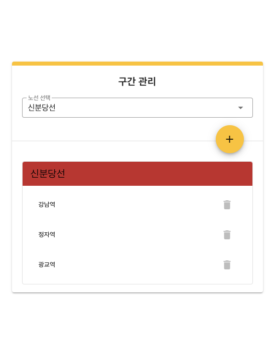
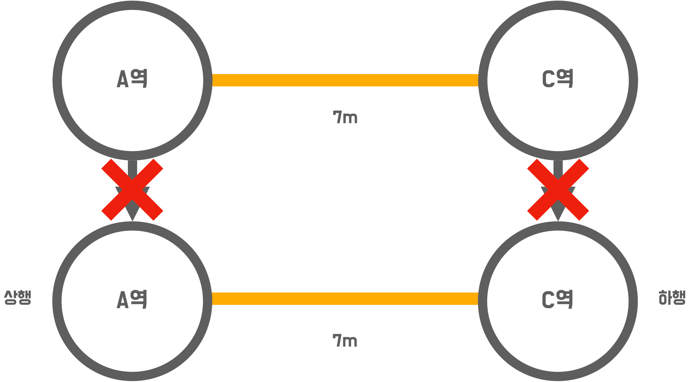
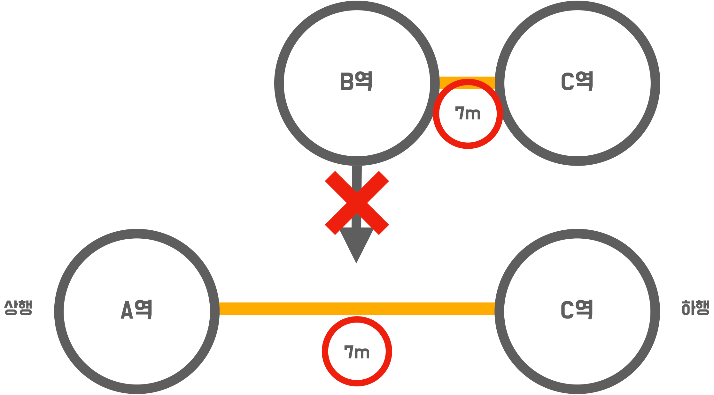
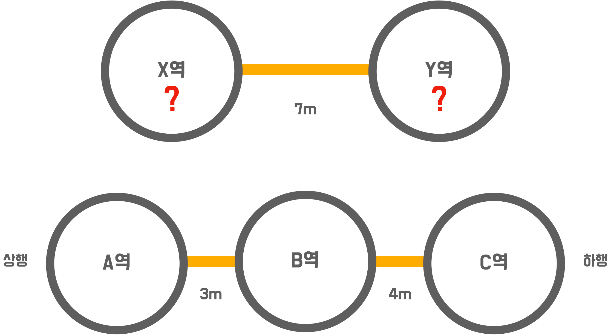
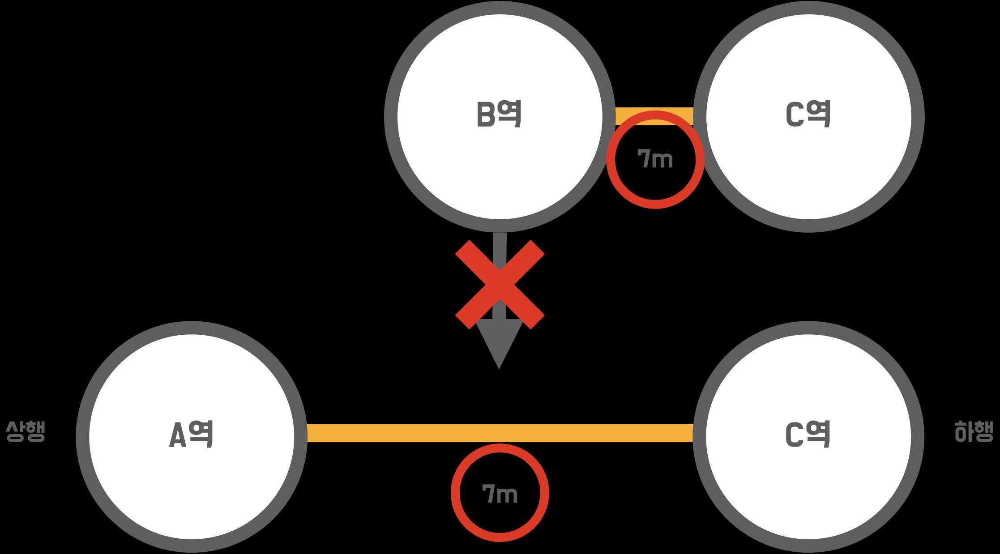
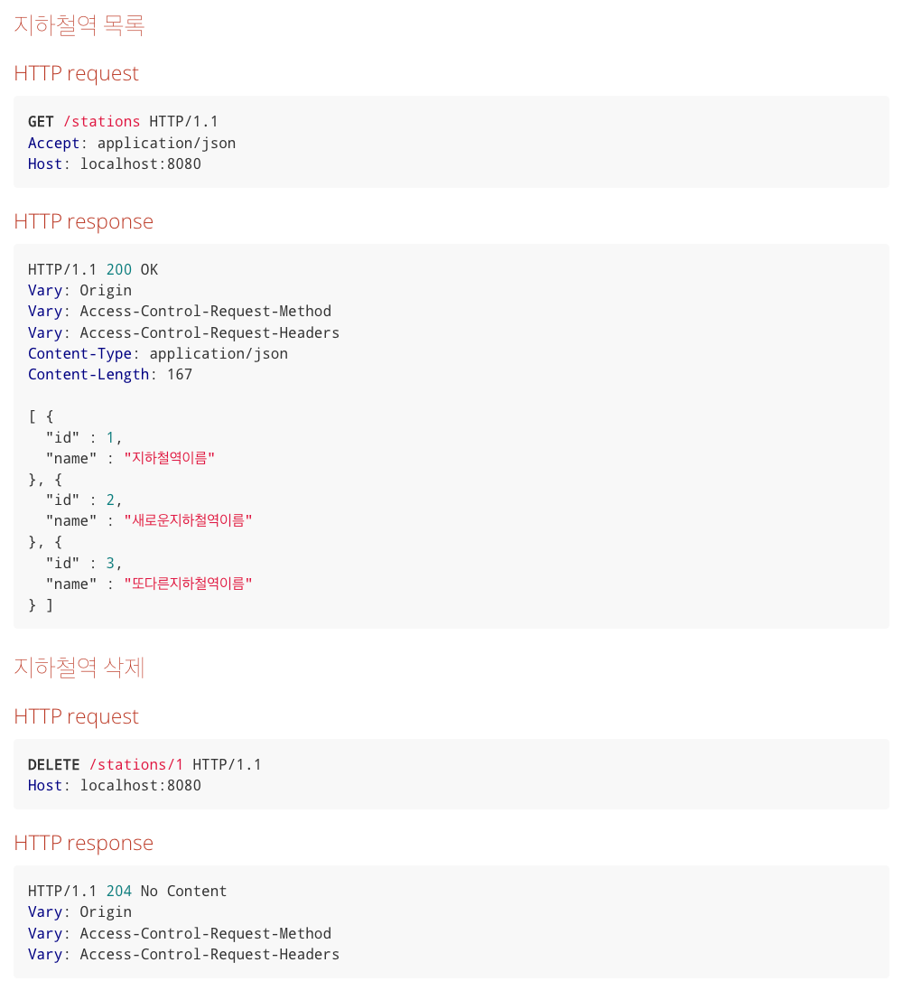
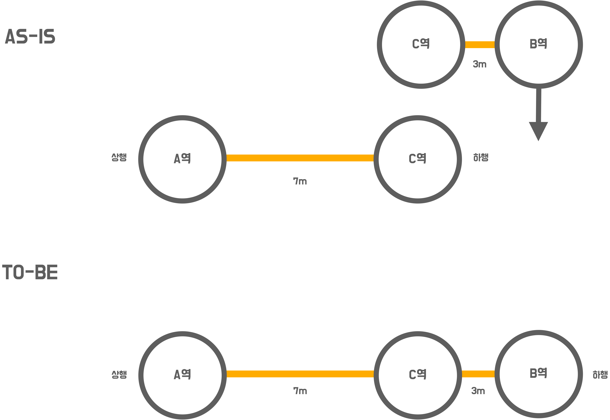
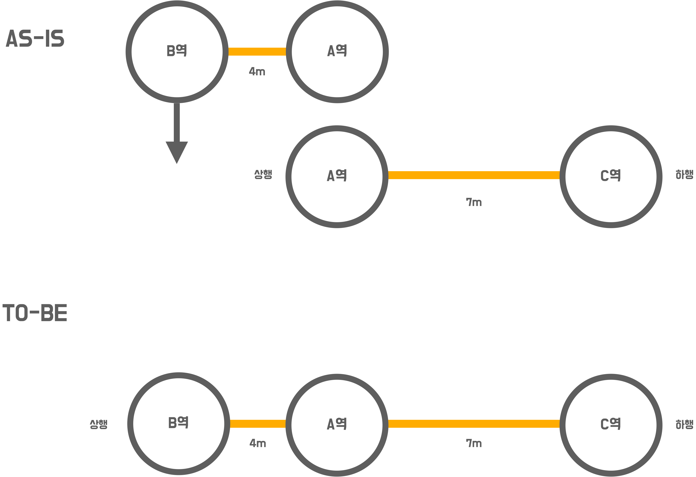

# 4단계 - 구간 제거 기능
## 요구사항
#### 지하철 구간 제거 기능을 구현하기
#### 노선의 구간을 제거하는 기능을 구현하기
* 구간 삭제 시 예외 케이스를 고려하기
* 구간 삭제 Request 접기/펼치기
#### 지하철 구간 삭제 request
```http request
DELETE /lines/1/sections?stationId=2 HTTP/1.1
accept: */*
host: localhost:52165
```

## 요구사항 설명
### 노선의 구간을 제거하는 기능을 구현하기
* 종점이 제거될 경우 다음으로 오던 역이 종점이 됨
* 중간역이 제거될 경우 재배치를 함
  * 노선에 A - B - C 역이 연결되어 있을 때 B역을 제거할 경우 A - C로 재배치 됨
  * 거리는 두 구간의 거리의 합으로 정함   


### 구간 삭제 시 예외 케이스를 고려하기
* 기능 설명을 참고하여 예외가 발생할 수 있는 경우를 검증할 수 있는 인수 테스트를 만들고 이를 성공 시키세요.
> 예시) 노선에 등록되어있지 않은 역을 제거하려 한다.

#### 구간이 하나인 노선에서 마지막 구간을 제거할 때
* 제거할 수 없음

## 힌트
### 구간 제거
#### 구간 제거 요청 처리
```java
@DeleteMapping("/{lineId}/sections")
public ResponseEntity removeLineStation(
@PathVariable Long lineId,
@RequestParam Long stationId) {
        lineService.removeSectionByStationId(lineId, stationId);
        return ResponseEntity.ok().build();
}
```
## 프론트엔드

--------------------------
# 3단계 - 구간 추가 기능
## 요구사항
#### 지하철 구간 등록 기능을 구현하기
* 기능 구현 전 인수 테스트 작성  
* 예외 케이스 처리 인수 테스트 작성  
  
구간 등록 API Request
```html
POST /lines/1/sections HTTP/1.1
accept: */*
content-type: application/json; charset=UTF-8
host: localhost:52165

{
  "downStationId": "4",
  "upStationId": "2",
  "distance": 10
}
```
## 요구사항 설명
### 지하철 구간 등록 인수 테스트 작성과 기능 구현
#### 역 사이에 새로운 역을 등록할 경우
* 새로운 길이를 뺀 나머지를 새롭게 추가된 역과의 길이로 설정

#### 새로운 역을 상행 종점으로 등록할 경우


#### 새로운 역을 하행 종점으로 등록할 경우


### 구간 등록 시 예외 케이스를 고려하기
#### 역 사이에 새로운 역을 등록할 경우 기존 역 사이 길이보다 크거나 같으면 등록을 할 수 없음


#### 상행역과 하행역이 이미 노선에 모두 등록되어 있다면 추가할 수 없음
* 아래의 이미지 에서 A-B, B-C 구간이 등록된 상황에서 B-C 구간을 등록할 수 없음(A-C 구간도 등록할 수 없음)
image.png
#### 상행역과 하행역 둘 중 하나도 포함되어있지 않으면 추가할 수 없음


## 힌트
### 구간 등록 인수 테스트
#### SectionAcceptanceTest 예시
```java
@DisplayName("노선에 구간을 등록한다.")
@Test
void addSection() {
    // when
    // 지하철_노선에_지하철역_등록_요청

    // then
    // 지하철_노선에_지하철역_등록됨
}
```
#### @BeforeEach
* BeforeEach 애너테이션을 이용하면 테스트 클래스의 테스트 메서드 실행 전 실행
* given 절에 대한 중복 코드를 제거할 수 있음
```java
@BeforeEach
public void setUp() {
    super.setUp();

    // given
    강남역 = StationAcceptanceTest.지하철역_등록되어_있음("강남역").as(StationResponse.class);
    광교역 = StationAcceptanceTest.지하철역_등록되어_있음("광교역").as(StationResponse.class);

    createParams = new HashMap<>();
    createParams.put("name", "신분당선");
    createParams.put("color", "bg-red-600");
    createParams.put("upStation", 강남역.getId() + "");
    createParams.put("downStation", 광교역.getId() + "");
    createParams.put("distance", 10 + "");
    신분당선 = 지하철_노선_등록되어_있음(createParams).as(LineResponse.class);
}
```
#### SectionRequest 예시
```java
public class SectionRequest {
  private Long upStationId;         // 상행역 아이디
  private Long downStationId;       // 하행역 아이디
  private int distance;             // 거리

  ...
}
```
### 구간 등록 기능 구현
#### LineController 예시
```java
...
@PostMapping("/{lineId}/sections")
public ResponseEntity addSection(
        @PathVariable Long lineId,
        @RequestBody SectionRequest sectionRequest) {
    // TODO: 구간 등록 기능 구현
    // ...
}
...
```
#### 기능 구현 팁
* 세부적인 예외 상황을 고려하지 않고 Happy Path 경우를 검증하기 위한 인수 테스트를 먼저 만드세요.
> "Happy Path"는 '아무것도 잘못되지 않는 사용자 시나리오'를 의미한다 (All-Pass Scenario / Positive Test). 이는 사람의 실수, 엣지 케이스, 의도를 벗어난 행동을 포함하지 않기 때문에 이 시나리오 대로 테스트를 수행하면 이슈나 버그가 발생할 가능성이 현저히 낮아진다.

### JPA 관계 맵핑
* 지하철역은 여러개의 지하철 노선에 포함될 수 있다.
  * ex) 강남역은 2호선에 등록되어 있는 동시에 신분당선에 등록되어 있음
* 따라서 다대다 관계로 보아 @ManyToMany로 관계를 맺을 수 있음
* 하지만 다대다 관계는 여러가지 예상치 못한 문제를 발생시킬 수 있어 추천하지 않음
  * https://ict-nroo.tistory.com/127 블로그를 참고하세요
* 지하철역과 지하철 노선의 맵핑 테이블을 엔티티로 두는 방법을 추천
  * 기존에 Station과 Line이 있었다면 Line에 속하는 Station을 LineStation이라는 엔티티로 도출
  * Line과 LineStation을 @ManyToOne 관계로 설정
* 참고할 코드:
https://github.com/next-step/atdd-subway-map/blob/boorownie/src/main/java/nextstep/subway/line/domain/LineStations.java
  * 참고한 코드에서는 LineStation을 일급컬렉션을 묶어 LineStations로 둠
  * JPA @Embedded And @Embeddable을 참고하세요.
--------------
# 2단계 - 인수 테스트 리팩터링
## 요구사항
#### API 변경 대응하기
* 노선 생성 시 종점역(상행, 하행) 정보를 요청 파라미터에 함께 추가하기
  * 두 종점역은 구간의 형태로 관리되어야 함
* 노선 조회 시 응답 결과에 역 목록 추가하기
  * 상행역 부터 하행역 순으로 정렬되어야 함

## 요구사항 설명

### 노선 생성 시 두 종점역 추가하기
* 인수 테스트와 DTO 등 수정이 필요함

```java
public class LineRequest {
  private String name;
  private String color;
  private Long upStationId;       // 추가
  private Long downStationId;     // 추가
  private int distance;           // 추가
  ...
}
```
### 노선 객체에서 구간 정보를 관리하기
* 노선 생성시 전달되는 두 종점역은 노선의 상태로 관리되는 것이 아니라 구간으로 관리되어야 함

```java
public class Line {
    ...
    private List<Section> sections;
    ...
}
```

### 노선의 역 목록을 조회하는 기능 구현하기
* 노선 조회 시 역 목록을 함께 응답할 수 있도록 변경
* 노선에 등록된 구간을 순서대로 정렬하여 상행 종점부터 하행 종점까지 목록을 응답하기
* 필요시 노선과 구간(혹은 역)의 관계를 새로 맺기

## 힌트
### 기능 변경 시 인수 테스트를 먼저 변경하기
* 기능(혹은 스펙) 변경 시 테스트가 있는 환경에서 프로덕션 코드를 먼저 수정할 경우 어려움을 겪을 수 있음
  * 프로덕션 코드를 수정하고 그에 맞춰 테스트 코드를 수정해 주어야 해서 두번 작업하는 느낌
* 항상 테스트를 먼저 수정한 다음 프로덕션을 수정하자!
* 더 좋은 방법은 기존 테스트는 두고 새로운 테스트를 먼저 만들고 시작하자!

## 프론트엔드


--------------------
# 1단계 - 지하철 노선 관리

## 요구사항

### 지하철 노선 관리 기능을 구현하기  

> 기능 목록: 생성 / 목록 조회 / 조회 / 수정 / 삭제

> 기능 구현 전 인수 테스트 작성  

> 기능 구현 후 인수 테스트 리팩터링

##
> 기능목록: 생성 / 목록조회 / 수정 / 삭제
> 1. 구현 전 인수테스트 작성
> 2. 기능구현
> 3. 리팩터링
##



## 요구사항 설명
### 지하철 노선 관련 기능의 인수 테스트를 작성하기

- LineAcceptanceTest 를 모두 완성시키세요.

```java
@DisplayName("지하철 노선 관련 기능")
public class LineAcceptanceTest extends AcceptanceTest {
    @DisplayName("지하철 노선을 생성한다.")
    @Test
    void createLine() {
        // when
        // 지하철_노선_생성_요청

        // then
        // 지하철_노선_생성됨
    }

    ...
}
```
### 지하철 노선 관련 기능 구현하기
- 인수 테스트가 모두 성공할 수 있도록 LineController를 통해 요청을 받고 처리하는 기능을 구현하세요.
```java
@RestController
@RequestMapping("/lines")
public class LineController {

    ...
    
    @PostMapping
    public ResponseEntity createLine(@RequestBody LineRequest lineRequest) {
        // TODO
    }

    @GetMapping
    public ResponseEntity<List<LineResponse>> findAllLines() {
        // TODO
    }
    
    ...
}
```
### 인수 테스트 리팩터링
- 인수 테스트의 각 스텝들을 메서드로 분리하여 재사용하세요.
    - ex) 인수 테스트 요청 로직 중복 제거 등

## 힌트  

### RestAssured  

> 미리 제공한 StationAcceptanceTest 코드를 활용하세요 :)

### given
- 요청을 위한 값을 설정 (header, content type 등)
- body가 있는 경우 body 값을 설정 함
### when
- 요청의 url와 method를 설정
### then
- 응답의 결과를 관리
- response를 추출하거나 response 값을 검증할 수 있음
> 자세한 사용법은 Usage Guide를 참고

### 프론트엔드
- 구현한 기능이 정상적으로 동작하는지 확인을 하기 위한 코드입니다.
- 반드시 페이지에 맞게 설계를 할 필요는 없고 프론트엔드 코드를 수정해도 무방합니다.

#### 지하철 노선 관리 페이지


------------------------


<p align="center">
    
</p>
<p align="center">
  
  
  <a href="https://edu.nextstep.camp/c/R89PYi5H" alt="nextstep atdd">
    
  </a>
  
</p>

<br>

# 지하철 노선도 미션
[ATDD 강의](https://edu.nextstep.camp/c/R89PYi5H) 실습을 위한 지하철 노선도 애플리케이션

<br>

## 🚀 Getting Started

### Install
#### npm 설치
```
cd frontend
npm install
```
> `frontend` 디렉토리에서 수행해야 합니다.

### Usage
#### webpack server 구동
```
npm run dev
```
#### application 구동
```
./gradlew bootRun
```
<br>

## ✏️ Code Review Process
[텍스트와 이미지로 살펴보는 온라인 코드 리뷰 과정](https://github.com/next-step/nextstep-docs/tree/master/codereview)

<br>

## 🐞 Bug Report

버그를 발견한다면, [Issues](https://github.com/next-step/atdd-subway-admin/issues) 에 등록해주세요 :)

<br>

## 📝 License

This project is [MIT](https://github.com/next-step/atdd-subway-admin/blob/master/LICENSE.md) licensed.
