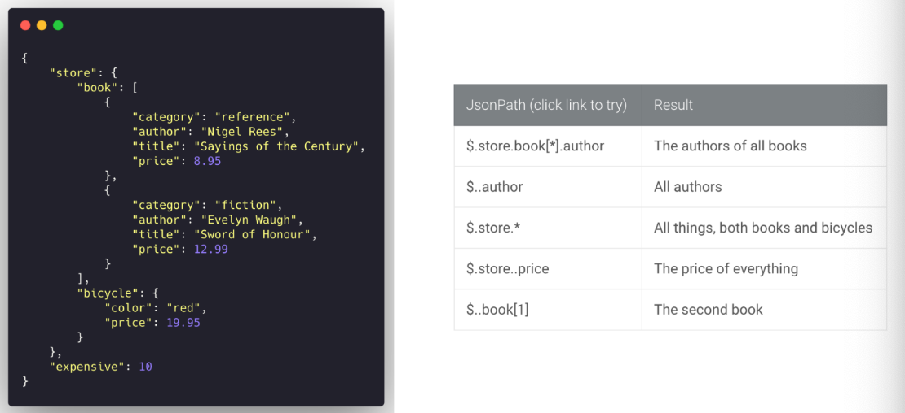
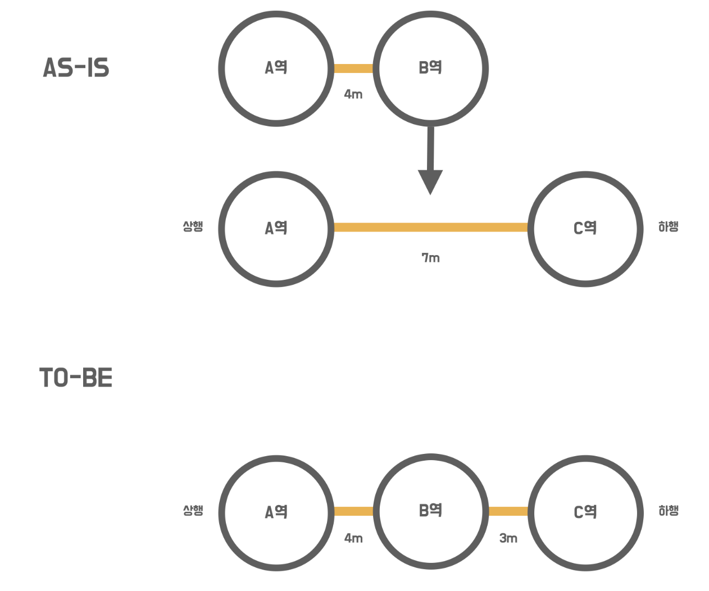
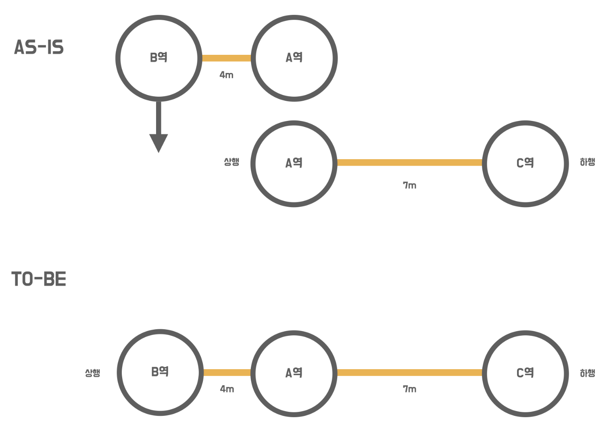
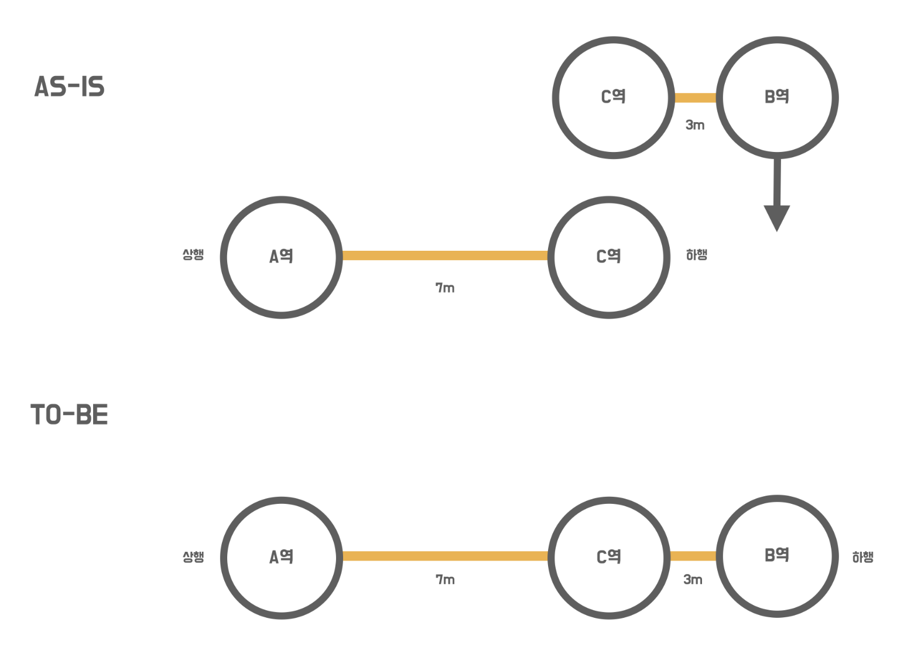
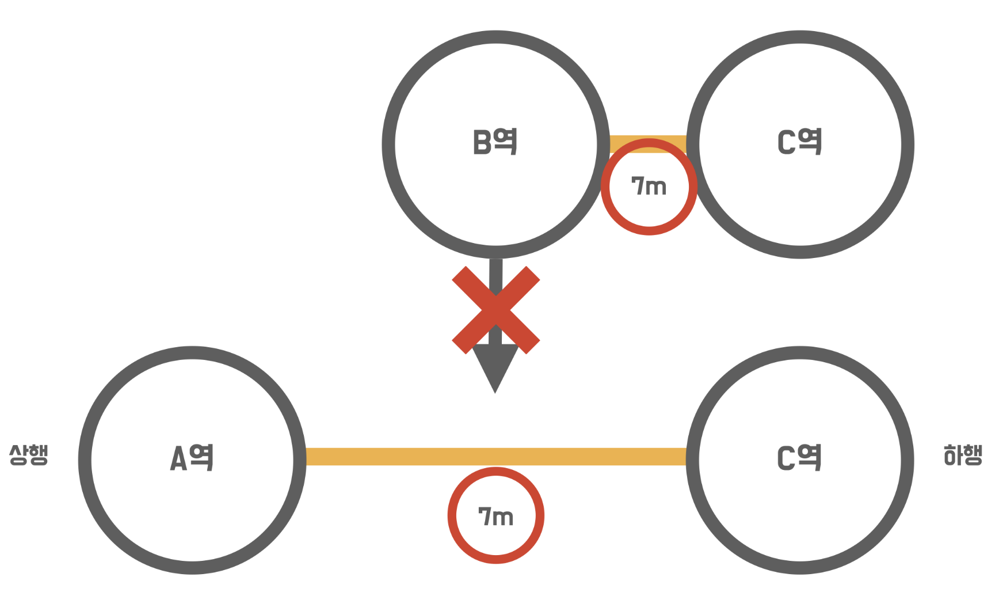
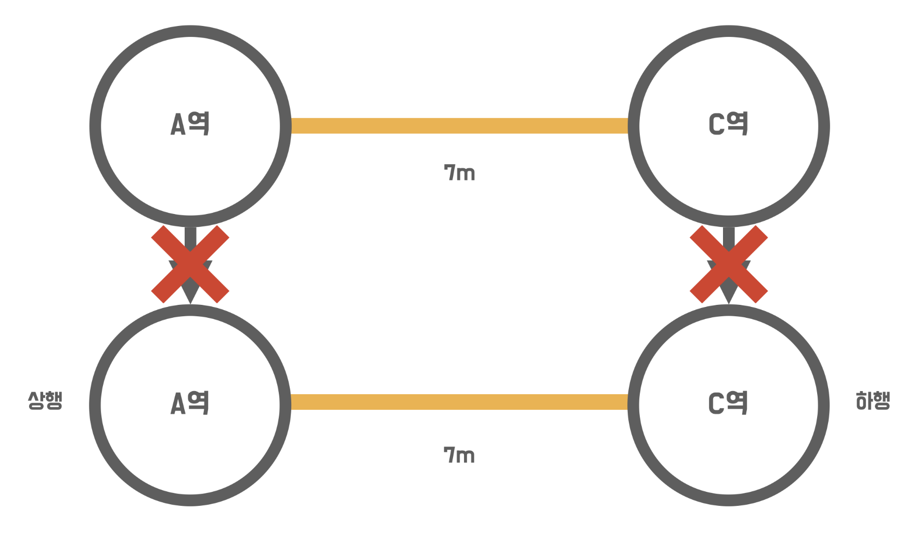
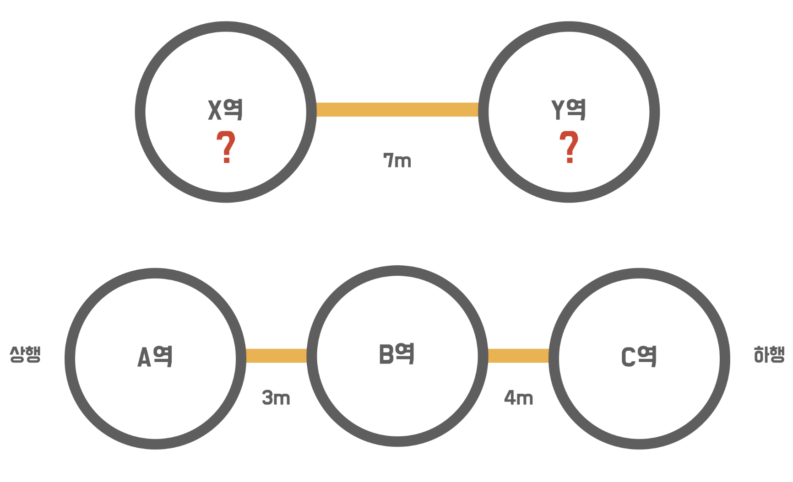
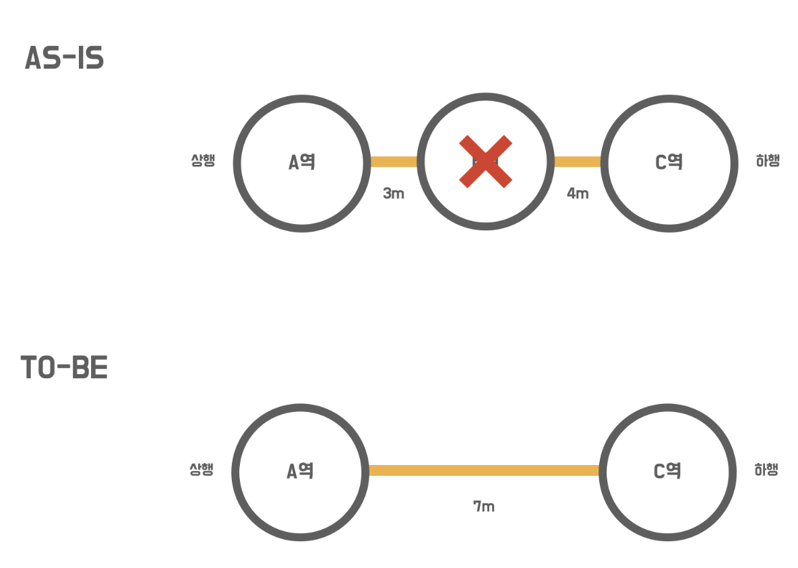
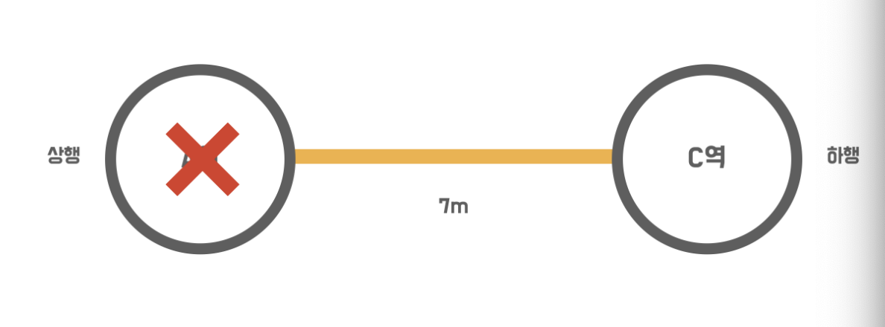

# 1단계 - 지하철역 인수 테스트 작성

## 기능 요구사항

* RestAssured를 활용
* 지하철역 관련 인수 테스트 완성
    * 지하철역 목록 조회
    * 지하철역 삭제

## 인수 조건 및 시나리오

```
# 지하철역을 생성한다

When 지하철역을 생성하면
Then 지하철역이 생성된다
Then 지하철역 목록 조회 시 생성한 역을 찾을 수 있다
```

```
# 기존에 존재하는 지하철역 이름으로 지하철역을 생성한다

Given 지하철역을 생성하고
When  기존에 존재하는 지하철역 이름으로 지하철역을 생성하면
Then  지하철역 생성이 안된다
```

```
# 지하철역을 조회한다

Given 2개의 지하철역을 생성하고
When  지하철역 목록을 조회하면
Then  2개의 지하철역을 응답 받는다
```

```
# 지하철역을 제거한다

Given 지하철역을 생성하고
When  그 지하철역을 삭제하면
Then  그 지하철역 목록 조회 시 생성한 역을 찾을 수 없다
```

## API 명세

### 지하철역 목록

### HTTP request

```
GET /stations HTTP/1.1
Accept: application/json
Host: localhost:8080
```

### HTTP response

```
HTTP/1.1 200 OK
Vary: Origin
Vary: Access-Control-Request-Method
Vary: Access-Control-Request-Headers
Content-Type: application/json
Content-Length: 167 
 
[ {
    "id" : 1,
    "name" : "지하철역이름"
}, {
    "id" : 2,
    "name" : "새로운지하철역이름"
}, {
    "id" : 3,
    "name" : "또다른지하철역이름"
} ]
```

## 지하철역 삭제

### HTTP request

``` 
DELETE /stations/1 HTTP/1.1
Host: localhost:8080
```

### HTTP response

```
HTTP/1.1 204 OK
Vary: Origin
Vary: Access-Control-Request-Method
Vary: Access-Control-Request-Headers
```

### 인수 테스트 리펙터링 힌트

* **JsonPath**
    * Json 문서를 읽어오는 DSL
    * JsonPath를 사용하면 Response Dto 객체로 받을 필요 없이 값만 추출할 수 있음
      

# 2단계 - 지하철 노선 기능

## 기능 요구사항

* 지하철 노선 관리 기능 구현
* 인수 테스트 작성

### 기능 목록

* 지하철 노선 생성
* 지하철 노선 목록 조회
* 지하철 노선 조회
* 지하철 노선 수정
* 지하철 노선 삭제

## 프로그래밍 요구사항

* 인수 조건을 검중하는 인수 테스트를 먼저 작성한 후, 해당하는 기능을 구현
* 인수 테스트를 서로 격리 시키기
* 인수테스트의 재사용성, 가독성, 빠른 테스트 의도 파악을 위해 테스트를 리펙터링 하기

<details>
    <summary>인수 조건</summary>

### 지하철 노선 생성

```
When: 지하철 노선을 생성하면
Then: 지하철 노선 목록 조회 시 생성한 노선을 찾을 수 있다
```

### 지하철 노선 목록 조회

```
Given: 2개의 지하철 노선을 생성하고
When: 지하철 노선 목록을 조회하면
Then: 지하철 노선 목록 조회 시 2개의 노선을 찾을 수 있다
```

### 지하철 노선 조회

```
Given: 지하철 노선을 생성하고
When: 생성한 지하철 노선 목록을 조회하면
Then: 생성한 지하철 노선의 정보를 응답받을 수 있다.
```

### 지하철 노선 수정

```
Given: 지하철 노선을 생성하고
When: 생성한 지하철 노선을 수정하면
Then: 해당 지하철 노선 정보는 수정된다
```

### 지하철 노선 삭제

```
Given: 지하철 노선을 생성하고
When: 생성한 지하철 노선을 삭제하면
Then: 해당 지하철 노선 정보는 삭제된다
```

</details>

<details>
    <summary>API 명세</summary>

### 지하철 노선

### 지하철 노선 등록

### HTTP request

```
POST /lines HTTP/1.1
Accept: application/json
Host: localhost:8080
Content-Length: 118

{
    "name" : "신분당선",
    "color" : "bg-red-600",
    "upStationId" : 1,
    "downStationId" : 2,
    "distance" : 10
}
```

### HTTP response

```
HTTP/1.1 201 CREATED
Vary: Origin
Vary: Access-Control-Request-Method
Vary: Access-Control-Request-Headers
Location: /lines/1
Content-Type: application/json
Content-Length: 193 
 
{
    "id" : 1,
    "name" : "신분당선",
    "color" : "bg-red-600",
    "stations" : [ {
        "id" : 1,
        "name" : "지하철역"
    }, {
        "id" : 2,
        "name" : "새로운 지하철역"
    }  ]
}
```

### 지하철 노선 목록

### HTTP request

```
GET /lines HTTP/1.1
Accept: application/json
Host: localhost:8080
```

### HTTP response

```
HTTP/1.1 200 OK
Vary: Origin
Vary: Access-Control-Request-Method
Vary: Access-Control-Request-Headers
Content-Type: application/json
Content-Length: 391
 
[   {
        "id" : 1,
        "name" : "신분당선",
        "color" : "bg-red-600",
        "stations" : [ {
            "id" : 1,
            "name" : "지하철역"
        }, {
            "id" : 2,
            "name" : "새로운 지하철역"
        }  ]
}, {
        "id" : 2,
        "name" : "분당선",
        "color" : "bg-green-600",
        "stations" : [ {
            "id" : 1,
            "name" : "지하철역"
        }, {
            "id" : 3,
            "name" : "또다른 지하철역"
        }  ]
}   ]
```

### 지하철 노선 조회

### HTTP request

```
GET /lines/1 HTTP/1.1
Accept: application/json
Host: localhost:8080
```

### HTTP response

```
HTTP/1.1 200 OK
Vary: Origin
Vary: Access-Control-Request-Method
Vary: Access-Control-Request-Headers
Content-Type: application/json
Content-Length: 193
 
{
        "id" : 1,
        "name" : "신분당선",
        "color" : "bg-red-600",
        "stations" : [ {
            "id" : 1,
            "name" : "지하철역"
        }, {
            "id" : 2,
            "name" : "새로운 지하철역"
        }  ]
}
```

### 지하철 노선 수정

### HTTP request

```
PUT /lines/1 HTTP/1.1
Accept: application/json
Host: localhost:8080
Content-LengTh: 58

{
    "name" : "다른분당선",
    "color" : "bg-red-600"
}
```

### HTTP response

```
HTTP/1.1 200 OK
Vary: Origin
Vary: Access-Control-Request-Method
Vary: Access-Control-Request-Headers
```

### 지하철 노선 삭제

### HTTP request

```
DELETE /lines/1 HTTP/1.1
Host: localhost:8080
```

### HTTP response

```
HTTP/1.1 204 OK
Vary: Origin
Vary: Access-Control-Request-Method
Vary: Access-Control-Request-Headers
```

</details>

### 힌트

### 인수 테스트 격리

### @DirtiesContext

* Spring Bean의 상태를 오염시키면 컨텍스트 재사용이 불가능하여, 컨텍스트를 다시 로드해야함
* 스프링 빈의 상태가 오염되었다는 설정을 하는 어노테이션
* H2 DB를 사용하는 테스트 환경에서, 컨텍스트를 새로 띄우면 기존 DB 내용이 초기화 된다

### @Sql

* 테스트 수행 시 특정 쿼리를 동작시키는 어노테이션

### Table Truncate

* 테이블을 조회하여 각 테이블을 Truncate 시켜주는 방법

### 인수 테스트 리펙터링

* **중복 코드 처리**
    * 지하철역과 노선 테스트의 중복되는 Feature를 적절히 분리하도록 한다

# 3단계 - 구간 추가 기능

## 기능 요구사항

* `요구사항 설명` 에서 제공되는 요구사항을 기반으로 **지하철 구간 추가 기능**을 구현
* 요구사항을 정의한 **인수 조건 조출(1)**
* 인수 조건을 검증하는 **인수 테스트 작성(2)**
* 예외 케이스에 대한 검증도 포함

### 기능 목록

* 역 사이에 새로운 역을 등록
* 새로운 역을 상행 종점으로 등록
* 새로운 역을 하행 종점으로 등록
* 역 사이에 새로운 역 등록 실패 - 기존 역 사이 길이보다 크거나 같은 경우
* 구간 등록 실패 - 상행역과 하행역이 이미 노선에 모두 등록되어 있는 경우
* 구간 등록 실패 - 상행역과 하행역 둘중 하나도 포함되어 있지 않은 경우

<details>
  <summary>인수 조건</summary>

### 상행 종점 등록 성공

```
given: 두 개의 지하철 역을 생성하고
given: 생성한 두 개의 지하철 역을 각 상행 종점, 하행 종점으로 포함하는 노선을 생성하고
when:  새로운 상행 종점을 포함하는 구간을 노선에 등록하면
then:  노선의 새로운 상행 종점 구간이 등록 된다
```

### 하행 종점 등록 성공

```
given: 두 개의 지하철 역을 생성하고
given: 생성한 두 개의 지하철 역을 각 상행 종점, 하행 종점으로 포함하는 노선을 생성하고
when:  새로운 하행 종점을 포함하는 구간을 노선에 등록하면
then:  노선의 새로운 하행 종점 구간이 등록 된다
```

### 상행 구간 등록 성공

```
given: 두 개의 지하철 역을 생성하고
given: 생성한 두 개의 지하철 역을 각 상행 종점, 하행 종점으로 포함하는 노선을 생성하고
when:  기존 상행 종점을 기준으로 하는 노선 구간을 등록하면
then:  노선의 새로운 구간이 등록된다
```

### 하행 구간 등록 성공

```
given: 두 개의 지하철 역을 생성하고
given: 생성한 두 개의 지하철 역을 각 상행 종점, 하행 종점으로 포함하는 노선을 생성하고
when:  기존 하행 종점을 기준으로 하는 노선 구간을 등록하면
then:  노선의 새로운 구간이 등록된다
```

### 구간 추가 실패 - 이미 존재하는 구간

```
given: 두 개의 지하철 역을 생성하고
given: 생성한 두 개의 지하철 역을 각 상행 종점, 하행 종점으로 포함하는 노선을 생성하고
when:  동일한 상행 종점, 하행 종점을 가지는 구간을 등록하면
then:  노선의 구간으로 등록되지 않는다
```

### 구간 추가 실패 - 상행역과 하행역 둘 중 하나도 포함되어 있지 않은 경우

```
given: 두 개의 지하철 역을 생성하고
given: 생성한 두 개의 지하철 역을 각 상행 종점, 하행 종점으로 포함하는 노선을 생성하고
given: 생성한 노선에 포함되지 않는 새로운 두 개의 지하철 역을 생성하고
when:  노선의 구간에 포함되지 않는 두 개의 지하철 역을 노선의 구간으로 등록하면
then:  노선의 구간으로 등록되지 않는다
```

### 상행 구간 등록 실패 - 기존 역 사이 길이보다 크거나 같은 경우

```
given: 두 개의 지하철 역을 생성하고
given: 생성한 두 개의 지하철 역을 각 상행 종점, 하행 종점으로 포함하는 노선을 생성하고
given: 구간의 길이가 동일한 구간을 생성하고
when:  구간의 길이가 동일한 구간을 노선의 구간으로 등록하면
then:  노선의 구간으로 등록되지 않는다
```

</details>

## 프로그래밍 요구사항

* 인수 테스트 주도 개발 프로세스에 맞춰 기능을 구현
    * `요구사항 설명`을 참고하여 **인수 조건 정의(1)**
    * 인수 조건을 검증하는 **인수 테스트 작성(2)**
    * 인수 테스트를 충족하는 **기능 구현(3)**
* 인수 조건은 인수 테스트 메서드 상단에 주석으로 작성
    * 뼈대 코드의 인수 테스트 참고
* 인수 테스트 격리
* 가독성, 빠른 의도 파악을 위해 테스트 리펙터링 수행

## API 명세

### 구간 등록 API

### request

```
POST /lines/1/sections HTTP/1.1
accept: */*
content-type: application/json; charset=UTF-8
host: localhost:nnnnn

{
  "downStationId": "4",
  "upStationId": "2",
  "distance": 10
}
```

<details>
    <summary>지하철 구간 등록 인수 테스트 작성과 기능 구현</summary>

### 역 사이에 새로운 역을 등록할 경우

* 새로운 길이를 뺀 나머지를 새롭게 추가 된 역과의 길이로 설정
  

### 새로운 역을 상행 종점으로 등록할 경우



### 새로운 역을 하행 종점으로 등록할 경우



### 역 사이에 새로운 역 등록 실패 - 기존 역 사이 길이보다 크거나 같은 경우



### 구간 등록 실패 - 상행역과 하행역이 이미 노선에 모두 등록되어 있는 경우



### 구간 등록 실패 - 상행역과 하행역 둘중 하나도 포함되어 있지 않은 경우



</details>

## 힌트

### @BeforeEach

* `@BeforeEach` 어노테이션을 이용하면 테스트 클래스의 테스트 메서드 실행 전에 실행
* given 절에 대한 중복 코드를 제거할 수 있음

### 기능 구현 팁

* 세부적인 예외 상황을 고려하지 않고 `Happy Path` 경우를 검증하기 위한 인수 테스트를 먼저 작성한다
    * `Happy Path`
        * 아무것도 잘못되지 않는 행복한 시나리오
        * `All-Pass Scenario` / `Positive Test` 라고도 불린다

### JPA 관계 매핑

* `여러개의 지하철역`은 `여러개의 지하철 노선`에 `포함`될 수 있다
    * `@ManyToMany` 관계로 보이나, 실제로는 잘 사용하지 않음 (not recommended)
    * 지하철역과 지하철 노선의 매핑 테이블을 엔티티로 두는 방법을 추천
* `@Embeddable` 어노테이션 참고

# 4단계 - 구간 제거 기능

## 기능 요구사항
* 요구사항을 정의한 **인수 조건** 도출
* 인수 조건을 검증하는 **인수 테스트** 작성
* 예외 케이스에 대한 검증 포함

## 기능 목록
* 종점을 제거하는 경우
* 가운데 역을 제거하는 경우
* 구간이 하나인 노선에서 역을 제거하는 경우

## 프로그래밍 요구 사항
* **인수 테스트 주도 개발 프로세스**에 맞춰서 기능을 구현
  * **요구사항 설명** 을 참고하여 **인수 조건**을 정의
  * **인수 조건**을 검증하는 **인수 테스트 작성**
  * **인수 테스트**를 충족하는 **기능 구현**
* 인수 조건은 인수 테스트 메서드 상단에 **주석**으로 작성
* 인수 테스트 격리
* 인수 테스트의 재사용성, 가독성, 빠른 의도 파악을 위한 지속적인 테스트 리펙터링

## 요구사항 설명

### 지하철 구간 삭제 API
``` 
DELETE /lines/1/sections/stationId=2 HTTP/1.1
accept: */*
host: localhost:nnnnn
```

## 노선의 구간을 제거하는 기능을 구현
* 종점이 제거될 경우 다음으로 오던 역이 종점이 됨
* 중간역이 제거될 경우 재배치를 함
  * A - B - C 노선이 연결되어 있을 때, B 노선을 제거하면 A - C 로 재배치 됨
  * 구간 거리는 두 구간의 거리 합으로 정함

**가운데 노선이 제거 될 경우**


**구간이 하나인 노선에서 마지막 구간을 제거할 때**
* 제거 불가


## 인수 조건

### 상행 종점을 제거하는 경우
```
given: 두 개의 구간을 갖는 노선을 생성하고
when:  상행 종점을 삭제하면
then:  상행 종점이 삭제되고, 그 다음 역이 상행 종점이 된다
```

### 하행 종점을 제거하는 경우
```
given: 두 개의 구간을 갖는 노선을 생성하고
when:  하행 종점을 삭제하면
then:  하행 종점이 삭제되고, 그 이전 역이 하행 종점이 된다
```

### 가운데 역을 제거하는 경우
```
given: 두 개의 구간을 갖는 노선을 생성하고
when:  두 구간의 가운데 지점의 역을 삭제하면
then:  가운데 역이 삭제되고, 삭제 된 역 기준 상행역, 하행역이 새로운 구간이 된다 
```
### (예외) 구간이 하나인 노선에서 역을 제거하는 경우
``` 
given: 하나의 구간을 갖는 노선을 생성하고
when:  구간에 포함 된 역을 제거하면
then:  구간이 제거되지 않는다
```
