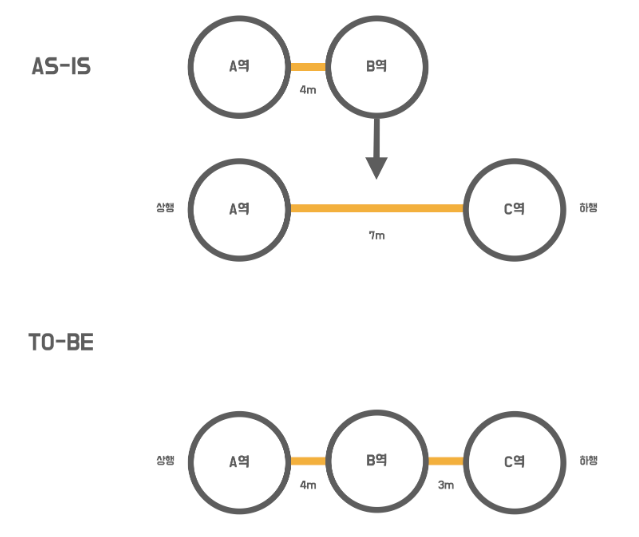
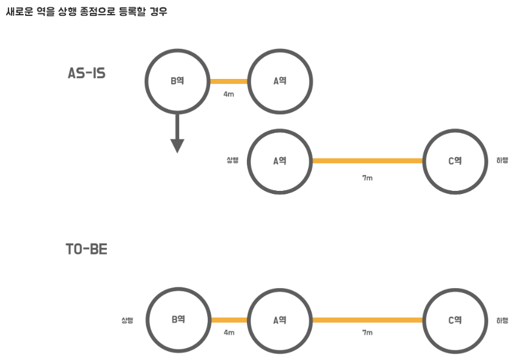
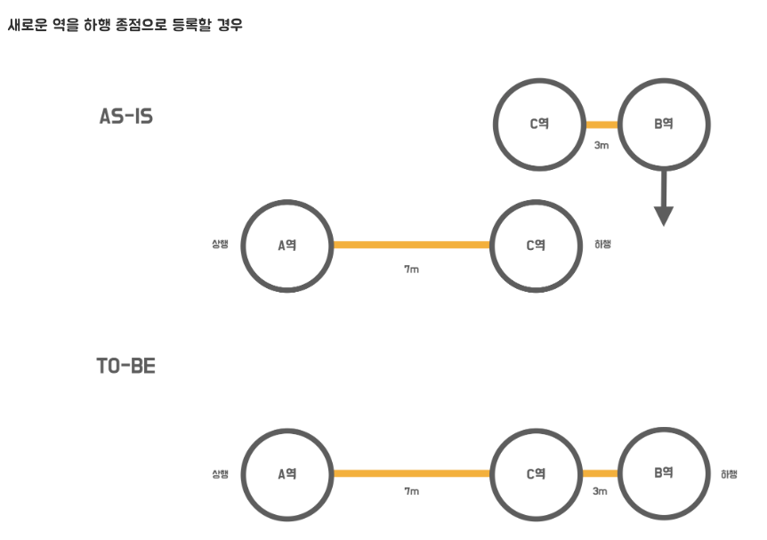
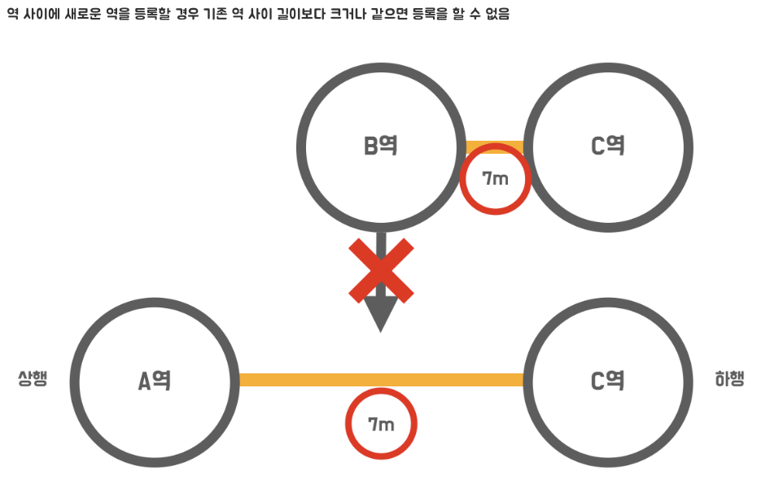
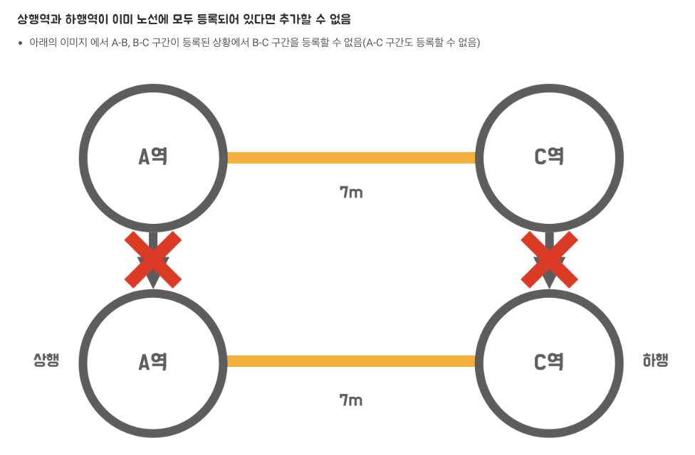
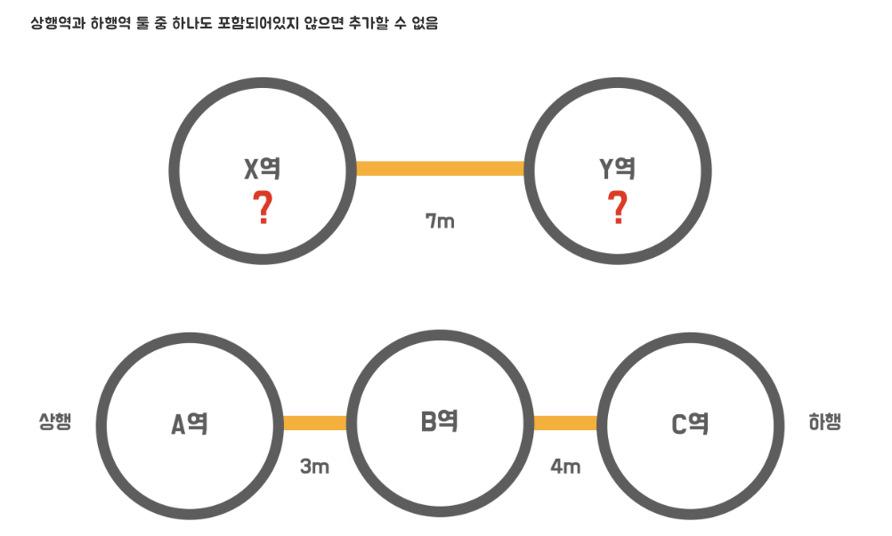

<p align="center">
    
</p>
<p align="center">
  
  
  <a href="https://edu.nextstep.camp/c/R89PYi5H" alt="nextstep atdd">
    
  </a>
  
</p>

<br>

# 지하철 노선도 미션
[ATDD 강의](https://edu.nextstep.camp/c/R89PYi5H) 실습을 위한 지하철 노선도 애플리케이션

<br>

## 🚀 Getting Started

### Install
#### npm 설치
```
cd frontend
npm install
```
> `frontend` 디렉토리에서 수행해야 합니다.

### Usage
#### webpack server 구동
```
npm run dev
```
#### application 구동
```
./gradlew bootRun
```
<br>

## ✏️ Code Review Process
[텍스트와 이미지로 살펴보는 온라인 코드 리뷰 과정](https://github.com/next-step/nextstep-docs/tree/master/codereview)

<br>

## 🐞 Bug Report

버그를 발견한다면, [Issues](https://github.com/next-step/atdd-subway-admin/issues) 에 등록해주세요 :)

<br>

## 📝 License

This project is [MIT](https://github.com/next-step/atdd-subway-admin/blob/master/LICENSE.md) licensed.

## 1단계 - 지하철 노선도 관리
> 구현된 기능을 대상으로 인수 테스트를 작성하는 단계  
> `RestAssured`를 활용하여 인수 테스틀르 만들어 볼 것

### 요구사항
- 지하철역 관련 인수테스트를 완성
  - [x] 지하철역 목록 조회 인수 테스트 작성하기
  - [x] 지하철역 삭제 인수 테스트 작성하기

### 프로그래밍 요구사항
- [x] 인수 테스트의 재사용성과 가독성, 그리고 빠른 테스트 의도 파악을 위해 인수 테스트를 리팩터링 할 것
> 각각의 테스트를 동작시키면 잘 동작하지만, 한번에 동작시키면 실패할 수 있음(테스트간 격리가 되지 않았기 때문에 데이터베이스에 데이터가 축적되기 때문)  
> 이번 단계에서는 고려할 사항이 아니라고 하였으나, 강의 내용을 기반으로 테스트간 격리방법 중 `DatabaseCleanup` utils을 작성하고 활용해보자.

### 1단계 피드백
- Q) given의 중복을 피할 수 있는 방법이 있는 지 문의
- A) 테스트 코드도 서비스 코드의 작성과 동일함. `지하철 생성` 역할의 메서드를 분리하여 공통적으로 사용

## 2단계 - 지하철 노선 기능
> - 제시된 인수 조건을 기반으로 기능 구현을 하는 단계
> - 기능 구현 전에 **_인수 조건을 만족하는 지 검증하는 인수 테스트를 먼저 만들고 기능 구현_**

### 구현 기능 목록
- [x] 지하철 노선 생성
  ```text
  When 지하철 노선을 생성하면
  Then 지하철 노선 목록 조회 시 생성한 노선을 찾을 수 있다
  ```
  ```http request
  POST /lines HTTP/1.1
  Content-Type: application/json
  Accept: application/json
  Content-Length: 118
  Host:  localhost:8080
  
  {
    "name" : "신분당선",
    "color" : "bg-red-600",
    "upStationId" : "1",
    "downStationId" : "2",
    "distance" : "10",
  }
  ```
  ```http response
  HTTP/1.1 201 Created
  Vary: Origin
  Vary: Access-Control-Request-Method
  Vary: Access-Control-Request-Headers
  Location: /lines/1
  Content-Type: application/json
  Content-Length: 193
  
  {
    "id" : 1,
    "name" : "신분당선",
    "color" : "bg-red-600",
    "stations" : [ {
      "id" : 1,
      "name" : "지하철역"
    }, {
      "id" : 2,
      "name" : "새로운지하철역"
    } ]
  }
  ```

- [x] 지하철 노선 목록 조회
  ```text
  Given 2개의 지하철 노선을 생성하고
  When 지하철 노선 목록을 조회하면
  Then 지하철 노선 목록 조회 시 2개의 노선을 조회할 수 있다.
  ```
  ```http request
  GET /lines HTTP/1.1
  Accept:  application/json
  Host:  localhost:8080
  ```
  ```http response
  HTTP/1.1 200 OK
  Vary: Origin
  Vary: Access-Control-Request-Method
  Vary: Access-Control-Request-Headers
  Content-Type: application/json
  Content-Length: 391
  
  [ {
    "id" : 1,
    "name" : "신분당선",
    "color" : "bg-red-600",
    "stations" : [ {
      "id" : 1,
      "name" : "지하철역"
    }, {
      "id" : 2,
      "name" : "새로운지하철역"
    } ]
  } , {
    "id" : 1,
    "name" : "분당선",
    "color" : "bg-red-600",
    "stations" : [ {
      "id" : 1,
      "name" : "지하철역"
    }, {
      "id" : 3,
      "name" : "새로운지하철역"
    } ]
  } ]
  ```

- [x] 지하철 노선 조회
  ```text
  Given 지하철 노선을 생성하고
  When 생성한 지하철 노선을 조회하면
  Then 생성한 지하철 노선의 정보를 응답받을 수 있다.
  ```
  ```http request
  GET /lines/1 HTTP/1.1
  Accept: application/json
  Host:  localhost:8080
  ```
  ```http response
  HTTP/1.1 200 OK
  Vary: Origin
  Vary: Access-Control-Request-Method
  Vary: Access-Control-Request-Headers
  Content-Type: application/json
  Content-Length: 193
  
  {
    "id" : 1,
    "name" : "신분당선",
    "color" : "bg-red-600",
    "stations" : [ {
      "id" : 1,
      "name" : "지하철역"
    }, {
      "id" : 2,
      "name" : "새로운지하철역"
    } ]
  }
  ```

- [x] 지하철 노선 수정
  ```text
  Given 지하철 노선을 생성하고
  When 생성한 지하철 노선을 수정하면
  Then 해당 지하철 노선 정보는 수정된다
  ```
  ```http request
  PUT /lines/1 HTTP/1.1
  Content-Type: application/json
  Content-Length: 58
  Host:  localhost:8080
  
  {
    "name" : "다른분당선",
    "color" : "bg-red-600"
  }
  ```
  ```http response
  HTTP/1.1 200 OK
  Vary: Origin
  Vary: Access-Control-Request-Method
  Vary: Access-Control-Request-Headers
  ```

- [x] 지하철 노선 삭제
  ```text
  Given 지하철 노선을 생성하고
  When 생성한 지하철 노선을 삭제하면
  Then 해당 지하철 노선 정보는 삭제된다
  ```
  ```http request
  DELETE /lines/1 HTTP/1.1
  Host:  localhost:8080
  ```
  ```http response
  HTTP/1.1 204 No Content
  Vary: Origin
  Vary: Access-Control-Request-Method
  Vary: Access-Control-Request-Headers
  ```

### 프로그래밍 요구사항
- 아래의 순서로 기능을 구현
  1. 인수 조건을 검증하는 인수 테스트 작성
  2. 인수 테스트를 충족하는 기능 구현
- 인수 테스트의 결과가 다른 인수 테스트에 영향을 끼치지 않도록 **인수 테스트를 서로 격리**
- 인수 테스트의 재사용성과 가독성, 그리고 빠른 테스트 의도 파악을 위해 인수 테스트를 리팩터링

### 힌트
- [x] 인수 테스트 격리 
  1. @DirtiesContext(더러운 상황(?)) : Spring Context를 이용한 테스트 동작 시 스프링 빈의 상태가 변경되면 해당 컨텍스트의 재사용이 불가능하여 컨텍스트를 다시 로드해야함
     - 격리 방법
       1. 스프링 빈의 상태가 변경되었다는 설정을 하는 애너테이션
       2. 대개의 경우 테스트 DB를 메모리 디비로 컨테이너에 띄워져 있는 상태이므로 **컨텍스트를 다시 로드시키면 DB 내용이 초기화됨** 
     - 장점 : 간단하게 설정 가능
     - 단점 : 느림
  2. @Sql : **_테스트 수행 시 특정 쿼리를 동작시키는 애너테이션_**
     - @DirtiesContext의 단점은 정말 말도안되게 느리다는 것이다.  
     근본적인 문제의 원인이 DB에 남아있는 데이터 때문이라면? --> 각 테스트 실행시마다 DB의 데이터를 깨끗하게 날리면 됨(`Table Truncate`)
- [x] 인수 테스트 리팩터링
  - 중복 코드 처리 : 중복되는 부분 별도 메소드로 역할을 분리하는 식으로 리펙터링 해 볼 것
  - 프론트엔드 : 노선 관리 페이지에서 기능이 제대로 동작하는 지 확인

### 2단계 피드백
- [x] 모든 유형의 변수에 final을 붙이는 습관을 들이자!
- [x] `@DataJpaTest`와 `DatabaseCleanup`를 동시에 사용할 수 있는 방법 모색
- [x] repository에서 바로 get하기 보단 메소드를 감쌀 것
  ```java
  // 예시
  // As-is
  Station station = stationRepository.findById(1L).get();
  // To-be
  assertThat(stationRepository.findById).{method}
  ```
  

## 3단계 - 구간 추가 기능
> - 제시된 인수 조건을 기반으로 기능 구현을 하는 단계
> - 기능 구현 전에 **_인수 조건을 만족하는 지 검증하는 인수 테스트를 먼저 만들고 기능 구현_**

### API 명세
```http request
POST /lines/1/sections HTTP/1.1
accept: */*
content-type: application/json; charset=UTF-8
host: localhost:52165

{
    "downStationId": "4",
    "upStationId": "2",
    "distance": 10
}
```
### 기능 목록 
- [x] 역 사이에 새로운 역을 등록할 경우  
  새로운 길이를 뺀 나머지를 새롭게 추가된 역과의 길이로 설정  


- [x] 새로운 역을 상행 종점으로 등록할 경우  


- [x] 새로운 역을 하행 종점으로 등록할 경우  


- [x] 역 사이에 새로운 역을 등록할 경우 기존 역 사이 길이보다 크거나 같으면 등록을 할 수 없음  


- [x] 상행역과 하행역이 이미 노선에 모두 등록되어 있다면 추가할 수 없음  


- [x] 상행역과 하행역 둘 중 하나도 포함되어있지 않으면 추가할 수 없음  


### 프로그래밍 요구사항
- 인수 테스트 주도 개발 프로세스에 맞춰서 기능을 구현하세요. 
  - `요구사항 설명`을 참고하여 인수 조건을 정의 
  - 인수 조건을 검증하는 인수 테스트 작성 
  - 인수 테스트를 충족하는 기능 구현
- 인수 조건은 인수 테스트 메서드 상단에 주석으로 작성하세요. 
- 뼈대 코드의 인수 테스트를 참고 
- 인수 테스트의 결과가 다른 인수 테스트에 영향을 끼치지 않도록 인수 테스트를 서로 격리 시키세요. 
- 인수 테스트의 재사용성과 가독성, 그리고 빠른 테스트 의도 파악을 위해 인수 테스트를 리팩터링 하세요.

### 힌트
1. 세부적인 예외 상황을 고려하지 않고 `Happy Path` 경우를 검증하기 위한 인수 테스트를 먼저 만들 것
> "Happy Path"는 '아무것도 잘못되지 않는 사용자 시나리오'를 의미한다 (All-Pass Scenario / Positive Test).  
> 이는 사람의 실수, 엣지 케이스, 의도를 벗어난 행동을 포함하지 않기 때문에 이 시나리오 대로 테스트를 수행하면 이슈나 버그가 발생할 가능성이 현저히 낮아진다.
2. 이전 단계에서 구현해 둔 TestUtil을 활용하여 구간 등록에 필요한 테스트 픽스처를 쉽게 생성
3. 지하철역은 여러개의 노선에 포함될 수 있다.(환승역의 경우 각 다른 노선에 포함됨)  
  이런 경우 다대다 관계로 보아`@ManyToMany` 관계로 맺을 수 있음
   - 다대다 관계는 `매핑 테이블을 엔티티`로 두어 회피하는 것을 지향  
   참고자료
     - [[JPA] @ManyToMany, 다대다[N:M] 관계](https://ict-nroo.tistory.com/127)
4. List<Station>을 별도 일급 컬렉션으로 묶어 사용
   - [LineStations 예시 코드](https://github.com/next-step/atdd-subway-map/blob/boorownie/src/main/java/nextstep/subway/line/domain/LineStations.java)
   - [JPA @Embedded And @Embeddable 활용](https://www.baeldung.com/jpa-embedded-embeddable)

### 3단계 피드백
- [x] Entity find 시 `RuntimeException` 외에 의미있는 Exception으로 대체해 볼 것
  - javax.persistence.NoResultException 으로 변경
- [x] connect 같은 의미있는 메서드로 추출
  - [ ] 이참에 `LineStation`이란 명명도 조금 더 의미있는 `Section`이란 이름으로 변경해보자. 
- [ ] 에러메시지 Enum 혹은 상수로 관리
- [ ] `getOrderedLineStations()` 메소드 내에서 Optional 값을 재할당 하는 과정에서 버그가 생길 경우 무한루프로 빠질 수 있는 위험한 코드.
  - Optional을 사용하지 않는다면?
  - 구간의 순서는 어떻게 찾을 지 고민..
- [x] 제너릭형에 타입 명시!