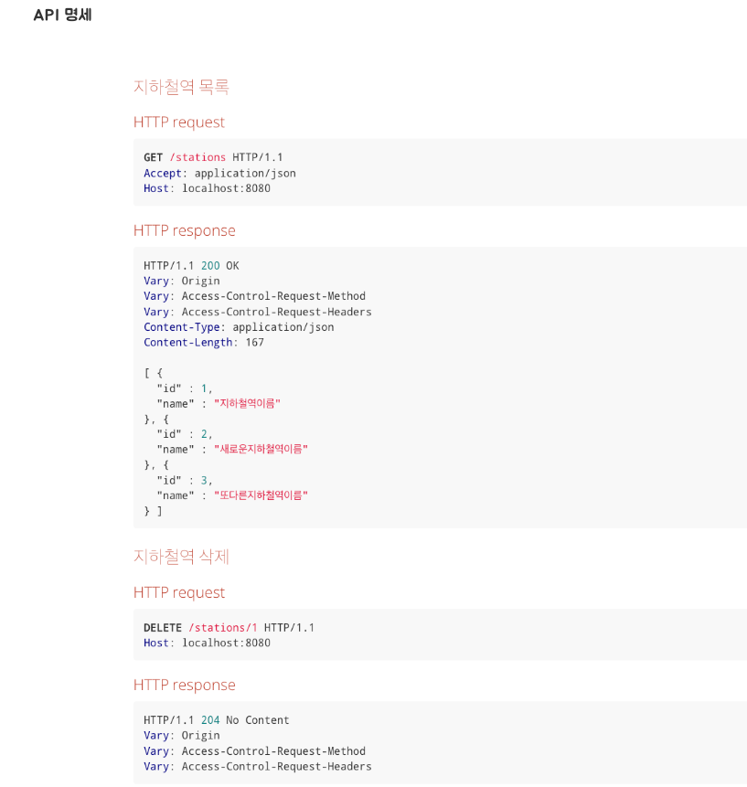

<p align="center">
    
</p>
<p align="center">
  
  
  <a href="https://edu.nextstep.camp/c/R89PYi5H" alt="nextstep atdd">
    
  </a>
  
</p>

<br>

# 지하철 노선도 미션
[ATDD 강의](https://edu.nextstep.camp/c/R89PYi5H) 실습을 위한 지하철 노선도 애플리케이션

<br>

## 🚀 Getting Started

### Install
#### npm 설치
```
cd frontend
npm install
```
> `frontend` 디렉토리에서 수행해야 합니다.

### Usage
#### webpack server 구동
```
npm run dev
```
#### application 구동
```
./gradlew bootRun
```
<br>

## ✏️ Code Review Process
[텍스트와 이미지로 살펴보는 온라인 코드 리뷰 과정](https://github.com/next-step/nextstep-docs/tree/master/codereview)

<br>

## 🐞 Bug Report

버그를 발견한다면, [Issues](https://github.com/next-step/atdd-subway-admin/issues) 에 등록해주세요 :)

<br>

## 📝 License

This project is [MIT](https://github.com/next-step/atdd-subway-admin/blob/master/LICENSE.md) licensed.

---
## 1단계 - 지하철역 인수 테스트 작성

### 기능 요구사항
* 지하철역 인수 테스트를 완성하세요.
  - [X] 지하철역 목록 조회 인수 테스트 작성하기
  - [X] 지하철역 삭제 인수 테스트 작성하기 
### 프로그래밍 요구사항
  - [X] 인수 테스트의 재사용성과 가독성, 그리고 빠른 테스트 의도 파악을 위해 인수 테스트를 리팩터링 하세요.


--- 
## 2단계 - 지하철 노선 기능

### 기능 요구 사항
* 요구사항 설명에서 제공되는 인수 조건을 기반으로 지하철 노선 관리 기능을 구현하세요.
* 인수 조건을 검증하는 인수 테스트를 작성하세요.


### 프로그래밍 요구사항
* 아래의 순서로 기능을 구현하세요.
  1. 인수 조건을 검증하는 인수 테스트 작성
  2. 인수 테스트를 충족하는 기능 구현
* 인수 테스트의 결과가 다른 인수 테스트에 영향을 끼치지 않도록 인수 테스트를 서로 격리 시키세요.
* 인수 테스트의 재사용성과 가독성, 그리고 빠른 테스트 의도 파악을 위해 인수 테스트를 리팩터링 하세요

### 도메인 분석
  * Line(지하철 노선)
    * 이름, 컬러, 상행종점역, 하행종점역, 거리

  * Station (역)
    * 이름 존재


### 인수 조건 

- [X] 지하철노선 생성
  ``` text
  When 지하철 노선을 생성하면
  Then 지하철 노선 목록 조회 시 생성한 노선을 찾을 수 있다
  ```
  
- [X] 지하철노선 목록 조회
  ```text
  Given 2개의 지하철 노선을 생성하고
  When 지하철 노선 목록을 조회하면
  Then 지하철 노선 목록 조회 시 2개의 노선을 조회할 수 있다.
  ```
  * 이번 단계에서는 지하철 노선에 역을 맵핑하는 기능은 없이
      노선 조회시 포함된 역 목록이 함께 응답되게  


- [X] 지하철노선 조회 
  ```text
  Given 지하철 노선을 생성하고
  When 생성한 지하철 노선을 조회하면
  Then 생성한 지하철 노선의 정보를 응답받을 수 있다.
  ```
- [X] 지하철노선 수정
  ```text
  Given 지하철 노선을 생성하고
  When 생성한 지하철 노선을 수정하면
  Then 해당 지하철 노선 정보는 수정된다
  ```
- [X] 지하철노선 삭제
  ```text
  Given 지하철 노선을 생성하고
  When 생성한 지하철 노선을 삭제하면
  Then 해당 지하철 노선 정보는 삭제된다
  ```
  <details>
  <summary>API 명세</summary>
  
   * 
  
  </details>

--- STEP3 구간 추가 기능

### 기능 요구 사항
* 요구사항 설명에서 제공되는 요구사항을 기반으로 지하철 구간 추가 기능을 구현하세요.
* 요구사항을 정의한 인수 조건을 조출하세요.
* 인수 조건을 검증하는 인수 테스트를 작성하세요.
* 예외 케이스에 대한 검증도 포함하세요.


### 프로그래밍 요구사항 
* 인수 테스트 주도 개발 프로세스에 맞춰서 기능을 구현하세요.
  * 요구사항 설명을 참고하여 인수 조건을 정의
  * 인수 조건을 검증하는 인수 테스트 작성
  * 인수 테스트를 충족하는 기능 구현
* 인수 조건은 인수 테스트 메서드 상단에 주석으로 작성하세요.
  * 뼈대 코드의 인수 테스트를 참고
* 인수 테스트의 결과가 다른 인수 테스트에 영향을 끼치지 않도록 인수 테스트를 서로 격리 시키세요.
* 인수 테스트의 재사용성과 가독성, 그리고 빠른 테스트 의도 파악을 위해 인수 테스트를 리팩터링 하세요.

### API 명세 
  ```http request
    POST /lines/1/sections HTTP/1.1
    accept: */*
    content-type: application/json; charset=UTF-8
    host: localhost:52165

    {
        "downStationId": "4",
        "upStationId": "2",
        "distance": 10
    }
  ```

### 인수 조건 
- [X] 구간의 노선을 조회
  ```text
     given 지하철 역을 생성하고 지하철 노선을 생성한다.
     when 노선의 구간을 조회한다.
     then 구간의 정보를 얻는다.
  ```

- [X] 노선에 구간 등록
  ```text
    given 지하철 역을 생성하고 지하철 노선을 추가한다.
    when 노선을 추가 등록하면  
    then 노선이 등록된다.
    then 기존의 구간은 거리가 신규 노선의 거리만큼 줄어든다
  ```

- [ ] 기존 노선보다 긴 노선 등록 
  ```text
     given 지하철 역을 생성하고 지하철 노선을 추가한다.
     when 기존 노선 보다 긴 노선을 등록 요청 한다.
     then 등록이 되지 않는다.
  ```
- [ ] 이미 존재하는 구간을 노선 구간에 등록한다.
  ```text
     given 지하철 역을 생성하고 지하철 노선을 추가한다.
     when 기존 노선과 같은 노선을 등록한다.
     then 등록이 되지 않는다.
  ```

- [ ] 상행역과 하행역이 포함되지 않는 노선을 구간에 등록한다.
  ```text
     given 지하철 역을 생성하고 지하철 노선을 추가한다.
     when 상행역과 하행역이 포함되지 않는 노선을 구간에 등록 요청한다.
     then 등록이 되지 않는다.
  ```

- [ ] 새로운 역을 상행 종점에 등록한다.
  ```text
     given 지하철 역을 생성하고 지하철 노선을 추가한다.
     when 상행역 노선의 새로운 역이며 하행역이 기존 상행종점인역인 구간을 등록 요청한다. 
     then 새로운 역이 상행 종점에 등록된다.
        - 이때는 거리를 신경쓰지 않는다.
  ```

- [ ] 새로운 역을 하행 종점에 등록한다.
  ```text
     given 지하철 역을 생성하고 지하철 노선을 추가한다.
     when 상행역이 기존 하행 종점이며 하행역 노선의 새로운 역인 노선을 등록 요청한다.  
     then 새로운 역을 하행 종점에 등록된다..
        - 이때는 거리를 신경쓰지 않는다.
  ```