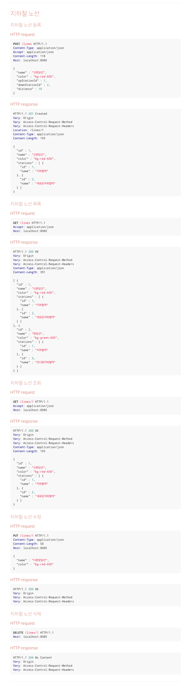

<p align="center">
    
</p>
<p align="center">
  
  
  <a href="https://edu.nextstep.camp/c/R89PYi5H" alt="nextstep atdd">
    
  </a>
  
</p>

<br>

# 지하철 노선도 미션
[ATDD 강의](https://edu.nextstep.camp/c/R89PYi5H) 실습을 위한 지하철 노선도 애플리케이션

<br>

## 🚀 Getting Started

### Install
#### npm 설치
```
cd frontend
npm install
```
> `frontend` 디렉토리에서 수행해야 합니다.

### Usage
#### webpack server 구동
```
npm run dev
```
#### application 구동
```
./gradlew bootRun
```
<br>

## ✏️ Code Review Process
[텍스트와 이미지로 살펴보는 온라인 코드 리뷰 과정](https://github.com/next-step/nextstep-docs/tree/master/codereview)

<br>

## 🐞 Bug Report

버그를 발견한다면, [Issues](https://github.com/next-step/atdd-subway-admin/issues) 에 등록해주세요 :)

<br>

## 📝 License

This project is [MIT](https://github.com/next-step/atdd-subway-admin/blob/master/LICENSE.md) licensed.

## 인수 테스트 주도 개발(ATDD) 미션 
* 인수 테스트는 블랙 박스 테스트 기반
    * 클라이언트는 표면적으로 확인할 수 잇는 요소를 바탕으로 검증
    * 실제 발생할 수 있는 **시나리오**를 바탕으로 요구사항 작성
    * 내부 구현이나 기술에 의존적이지 않음
* 인수 조건 예시
~~~yml
Feature: 최단 경로 구하기
  Scenario: 지하철 최단 경로 조회
    Given: 지하철역들이 등록되어 있다.
    And: 지하철노선이 등록되어 있다.
    And: 지하철노선에 지하철역들이 등록되어 있다.
    When: 사용자는 출발역과 도착역의 최단 경로 조회를 요청한다.
    Then: 사용자는 최단 경로의 역 정보를 응답받는다.
~~~
###  Step1 API명세 및 요구사항
#### 지하철역 목록
HTTP request
<pre>
GET /stations HTTP/1.1
Accept: application/json
Host: localhost:8080
</pre>
HTTP response
<pre>
HTTP/1.1 200 OK
Vary: Origin
Vary: Access-Control-Request-Method
Vary: Access-Control-Request-Headers
Content-Type: application/json
content-Length: 167
[
  {
  "id": 1,
  "name" "지하철역이름"
  },
  {
  "id": 2,
  "name" "지하철역이름2"
  }
]
</pre>
#### 지하철역 삭제
HTTP request
<pre>
DELETE /stations/1 HTTP/1.1
Host: localhost:8080
</pre>
HTTP response
<pre>
HTTP/1.1 204 No Content
Vary: Origin
Vary: Access-Control-Request-Method
Vary: Access-Control-Request-Headers
</pre>

- [X] 지하철역 목록 조회 인수 테스트 작성하기
    * 2개의 지하철역을 생성 후 조회하면, 등록한 2개의 지하철을 응답 받아야 함.
    * List<Map<>> 방식으로 호출했을 때 다중 등록 가능여부 테스트 -> __불가__
    * Map의 name 값에 ','로 구분하여 생성 요청 시 다중 등록 가능여부 테스트 -> __불가__
    * 생성API 2번 각각 호출하여 2개의 지하철역 생성 후 조회
- [X] 지하철역 삭제 인수 테스트 작성하기
    * 지하철역 생성 후 삭제하면, 삭제된 지하철은 조회되지 않음

#### Step1 회고
* RestAssured의 사용법을 제대로 파악하지 못하여 쓸데없는? 코드를 작성함.
* .extract()를 수행하면 ExtractableResponse 타입의 객체로 받을 수 있음
* .extract()를 수행하지 않으면 객체를 받지 않고 호출 API를 수행할 수 있음
* jsonPath()는  response를 받는 동시에 사용할 수 있고, 받은 후에도 사용할 수 있음
  * EX)
  ~~~java
  // 응답 받으면서 동시에 jsonpath()로 추출하는 case
  List<String> stationNames =
                RestAssured.given().log().all()
                        .when().get("/stations")
                        .then().log().all()
                        .extract().jsonPath().getList("name", String.class);
  
  // 응답 받고 jsonpath()로 추출하는 case
  ExtractableResponse saveResponse = RestAssured.given().log().all()
                .body(params)
                .contentType(MediaType.APPLICATION_JSON_VALUE)
                .when().post("/stations")
                .then().log().all()
                .extract();

  long deleteTargetStationId = saveResponse.body().jsonPath().getLong("id");
  String deleteTargetStationName = saveResponse.body().jsonPath().getString("name");
  ~~~
* 참조: https://www.programcreek.com/java-api-examples/?api=io.restassured.response.ExtractableResponse
### step2 - 지하철 노선 기능
#### API 명세
<pre>
노선 생성 시 상행종점역과 하행종점역을 등록합니다. 
따라서 이번 단계에서는 지하철 노선에 역을 맵핑하는 기능은 아직 없지만 노선 조회시 포함된 역 목록이 함께 응답됩니다.
</pre>

#### 기능 요구사항 및 인수조건
- [ ] 지하철 노선 생성
  * When 지하철 노선을 생성하면
  * Then 지하철 노선 목록 조회 시 생성한 노선을 찾을 수 있다
- [ ] 지하철 노선 목록 조회
  * Given 2개의 지하철 노선을 생성하고
  * When 지하철 노선 목록을 조회하면
  * Then 지하철 노선 목록 조회 시 2개의 노선을 조회할 수 있다.
- [ ] 지하철 노선 조회
  * Given 지하철 노선을 생성하고
  * When 생성한 지하철 노선을 조회하면
  * Then 생성한 지하철 노선의 정보를 응답받을 수 있다.
- [ ] 지하철 노선 수정
  * Given 지하철 노선을 생성하고
  * When 생성한 지하철 노선을 수정하면
  * Then 해당 지하철 노선 정보는 수정된다
- [ ] 지하철 노선 삭제
  * Given 지하철 노선을 생성하고
  * When 생성한 지하철 노선을 삭제하면
  * Then 해당 지하철 노선 정보는 삭제된다
