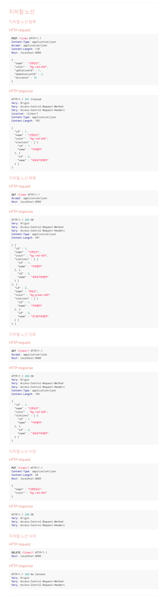

# 1단계 - 지하철역 인수 테스트 작성

## 기능 요구사항

- [x] 지하철역 목록 조회 인수 테스트 작성하기
- [x] 지하철역 삭제 인수 테스트 작성하기

---

# 2단계 - 지하철 노선 기능

## 기능 요구사항

- [x] 요구사항 설명에서 제공되는 인수 조건을 기반으로 지하철 노선 관리 기능을 구현하세요.
- [x] 인수 조건을 검증하는 인수 테스트를 작성하세요.

## 프로그래밍 요구사항

- 아래의 순서로 기능을 구현하세요.
  - 인수 조건을 검증하는 인수 테스트 작성
  - 인수 테스트를 충족하는 기능 구현
- 인수 테스트의 결과가 다른 인수 테스트에 영향을 끼치지 않도록 인수 테스트를 서로 격리 시키세요.
- 인수 테스트의 재사용성과 가독성, 그리고 빠른 테스트 의도 파악을 위해 인수 테스트를 리팩터링 하세요.

## 요구사항(스토리)

### 인수 조건

- 지하철노선 생성

```text
When 지하철 노선을 생성하면
Then 지하철 노선 목록 조회 시 생성한 노선을 찾을 수 있다
```

- 지하철노선 목록 조회

```text
Given 2개의 지하철 노선을 생성하고
When 지하철 노선 목록을 조회하면
Then 지하철 노선 목록 조회 시 2개의 노선을 조회할 수 있다.
```

- 지하철노선 조회

```text
Given 지하철 노선을 생성하고
When 생성한 지하철 노선을 조회하면
Then 생성한 지하철 노선의 정보를 응답받을 수 있다.
```

- 지하철노선 수정

```text
Given 지하철 노선을 생성하고
When 생성한 지하철 노선을 수정하면
Then 해당 지하철 노선 정보는 수정된다
```

- 지하철노선 삭제

```text
Given 지하철 노선을 생성하고
When 생성한 지하철 노선을 삭제하면
Then 해당 지하철 노선 정보는 삭제된다
```

## API 명세 참고 사항

> 노선 생성 시 상행종점역과 하행종점역을 등록합니다.
>
> 따라서 이번 단계에서는 지하철 노선에 역을 맵핑하는 기능은 아직 없지만 노선 조회시 포함된 역 목록이 함께 응답됩니다.

---

# 3단계 - 구간 추가 기능

## 요구사항

- 지하철 구간 테스트 추가
- 지하철 구간 등록 인수 테스트 작성과 기능 구현

## 유저 스토리

### 역 사이에 새로운 역을 등록할 경우

- 새로운 길이를 뺀 나머지를 새롭게 추가 역의 길이로 설정
- A와 C역이 있을때 그 거리가 10m일 경우 새로운 B역이 A와 4m 차이나는 경우 B와 C역의 차이는 3m가 된다.

### 새로운 역을 상행 종점으로 등록할 경우

- A와 C역이 상행과 하행이 존재할때, A에 B가 상행이 추가되는 경우 B-A-C 형태가 된다.

### 새로운 역을 하행 종점으로 등록할 경우

- A와 C역이 상행과 하행이 존재할때, C에 B가 하행이 추가되는 경우 A-C-B 형태가 된다.

### 구간 등록 시 예외 케이스를 고려하기

1. 역 사이에 새로운 역을 등록할 경우 기존 역 사이 길이보다 크거나 같으면 등록을 할 수 없음
2. 상행역과 하행역이 이미 노선에 모두 등록되어 있다면 추가할 수 없음
    - A-B, B-C 구간이 등록된 상황에서 B-C 구간을 등록할 수 없음(A-C 구간도 등록할 수 없음)
3. 상행역과 하행역 둘 중 하나도 포함되어있지 않으면 추가할 수 없음

## TODO LIST

- [] 역 사이에 새로운 역을 등록
- [] 새로운 역을 상행 종점으로 등록
- [] 새로운 역을 하행 종점으로 등록
- [] 구간 예외 케이스 고려

---

# 기능 참고사항

## 지하철 도메인


## API 명세


