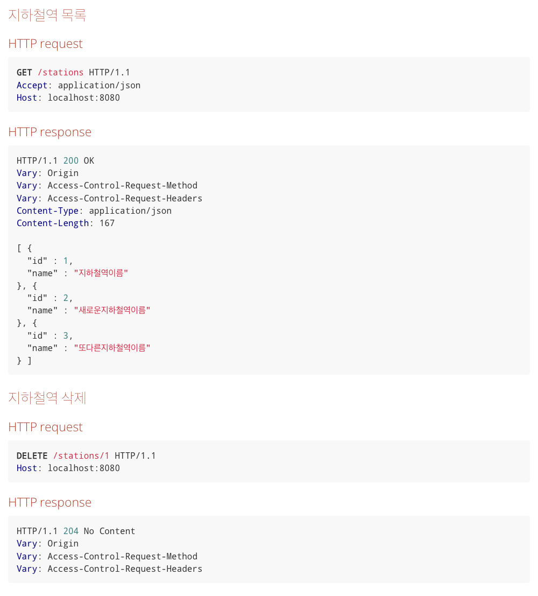

### 지하철역 인수 테스트 작성
요구사항
기능 요구사항
- 지하철역 목록 조회 인수 테스트 작성하기
- 지하철역 삭제 인수 테스트 작성하기

프로그래밍 요구사항
- 인수 테스트의 재사용성과 가독성, 그리고 빠른 테스트 의도 파악을 위해 인수 테스트를 리팩터링

(각각의 테스트를 동작시키면 잘 동작하지만 한번에 동작시키면 실패할 수 있습니다.
이번 단계에서는 이 부분에 대해 고려하지 말고 각각의 인수 테스트를 작성하는 것에 집중해서 진행하세요.)

API 명세

