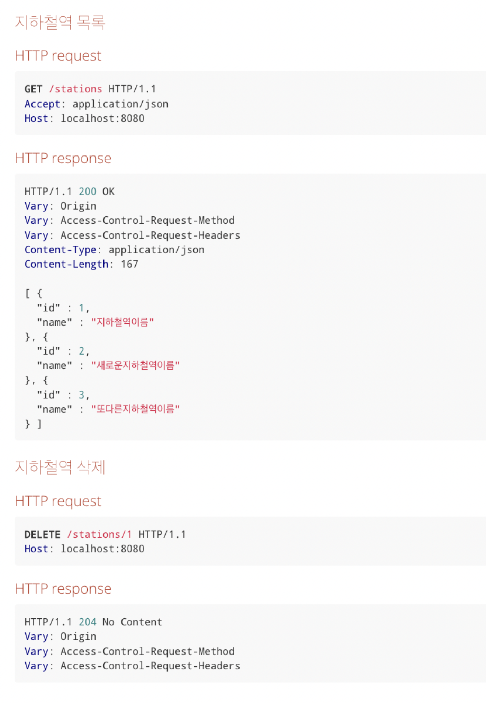

## 1단계 - 지하철역 인수 테스트 작성

---
### TODO
- [X] 지하철역 목록 조회 인수 테스트 작성
- [X] 지하철역 삭제 인수 테스트 작성
- [X] 인수 테스트 리팩터링
- [X] 테스트 케이스 격리
- ---
### 기능 요구사항
- 지하철역 인수 테스트 완성
  - 지하철역 목록 조회 인수 테스트 작성
  - 지하철역 삭제 인수 테스트 작성
### 프로그래밍 요구사항
- 인수 테스트 리팩터링
  - 인수 테스트의 재사용성/가독성/빠른 테스트 의도 파악을 위함
  - 여러 인수 테스트를 한 번에 동작시키지 않고, 한 번에 한 개의 인수 테스트만 실행한다고 가정
### API 명세

