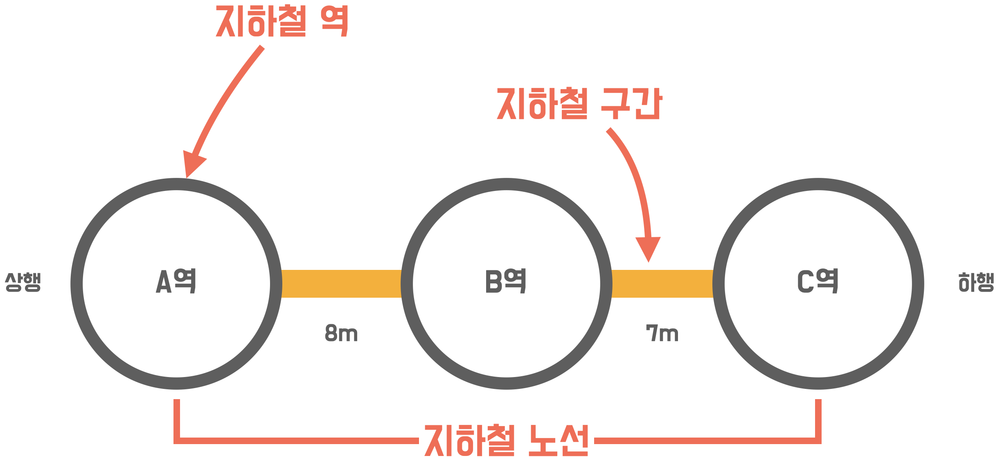
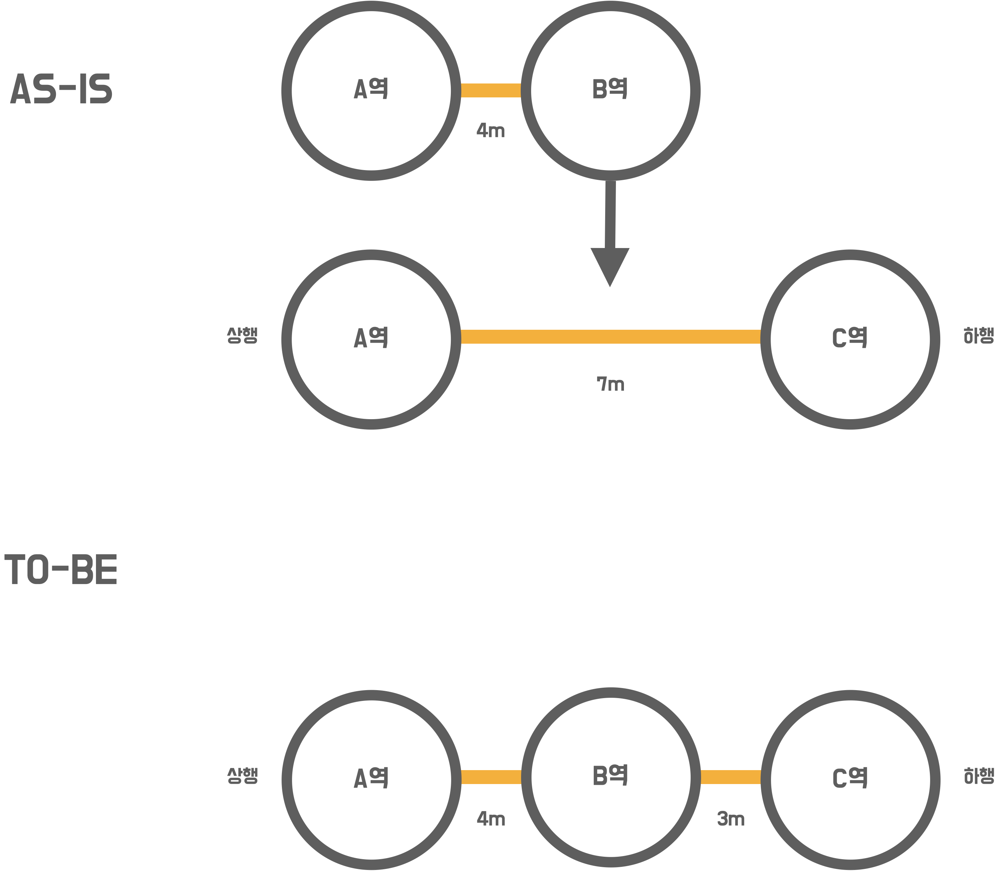
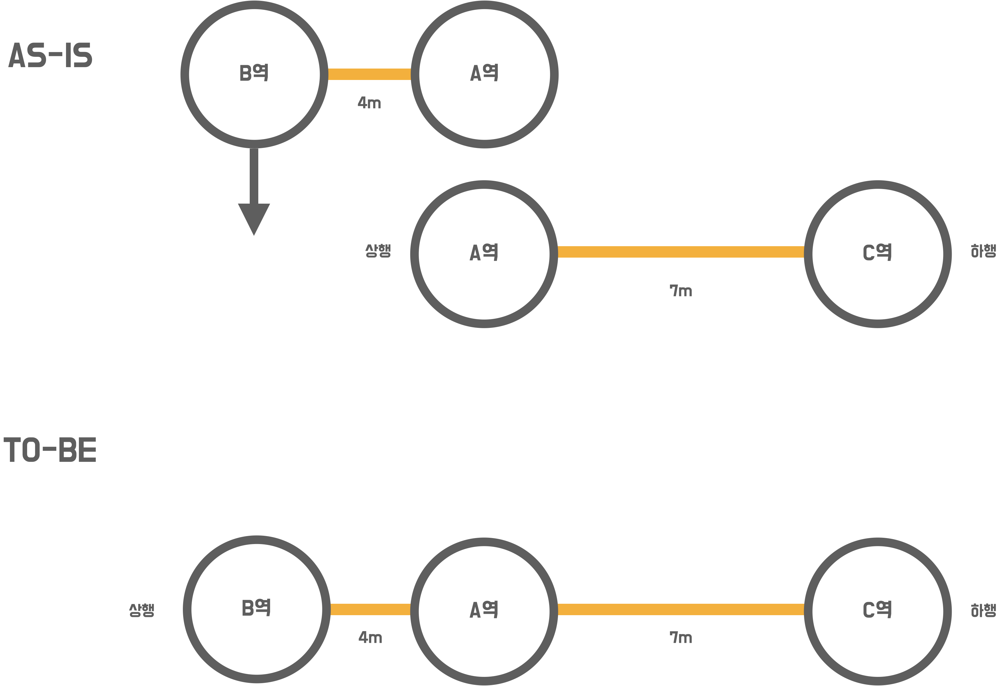
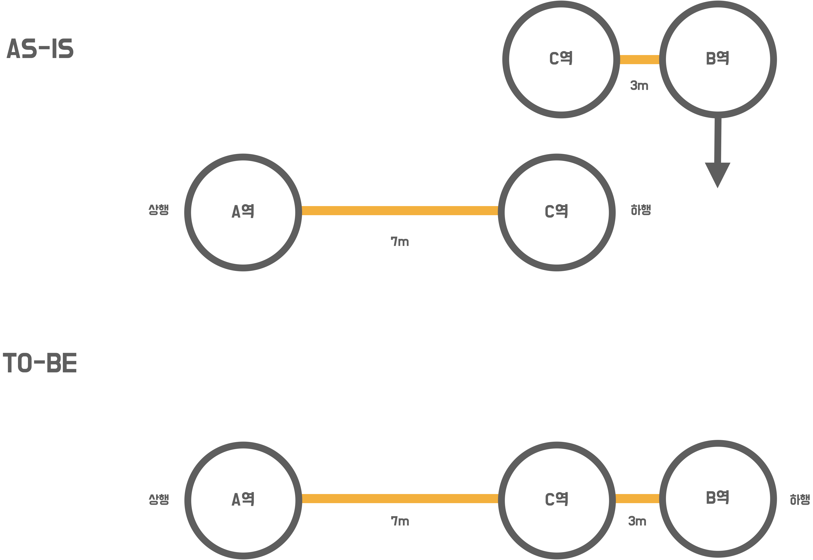
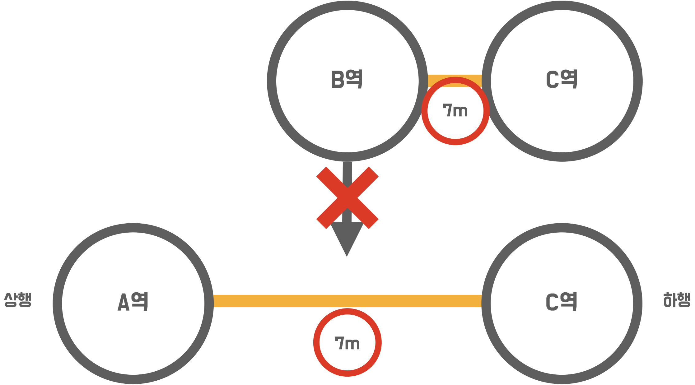
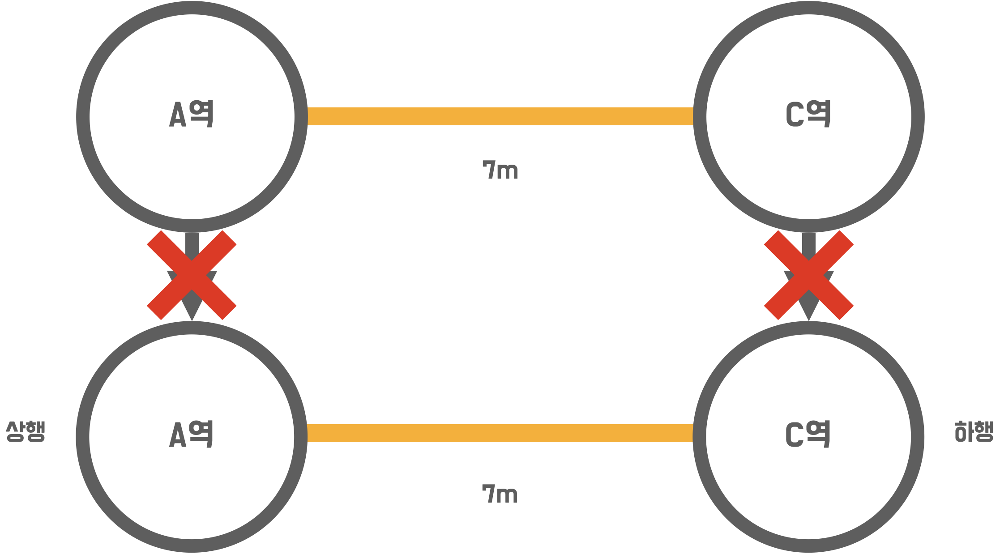
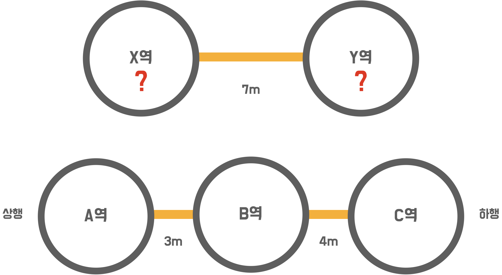

### 지하철 노선도 관리
미션 설명
```
지하철 노선도를 관리할 수 있는 어드민 서비스를 단계별로 구현하세요.

인수 테스트 주도 개발 프로세스를 단계별로 경험하세요.
```

도메인 설명

```
지하철 역(station)
- 지하철 역 속성:
    이름(name)

지하철 구간(section)
- 지하철 (상행 방향)역과 (하행 방향)역 사이의 연결 정보
- 지하철 구간 속성:
    길이(distance)

지하철 노선(line)
- 지하철 구간의 모음으로 구간에 포함된 지하철 역의 연결 정보
- 지하철 노선 속성:
    노선 이름(name)
    노선 색(color)
```

인수 테스트 주도로 개발하기
- 인수 조건 정의
  - 인수 테스트가 충족해야하는 조건
  - 이번 과정에서는 시나리오 형태로 표현
    - scenario-oriented (the Given/When/Then template)
- 인수 테스트 작성
  - 인수 조건을 검증하는 테스트
  - 실제 요청/응답하는 환경과 유사하게 테스트 환경을 구성
- 기능 구현
  - 인수테스트 기반으로 하나씩 기능 개발을 진행
---

### 1. 지하철역 인수 테스트

기능 요구사항
- 지하철역 인수 테스트를 완성하세요.
  - 지하철역 목록 조회 인수 테스트 작성하기
  - 지하철역 삭제 인수 테스트 작성하기

프로그래밍 요구사항
- 인수 테스트를 리팩터링 하세요.
  - 인수 테스트의 재사용성과 가독성, 그리고 빠른 테스트 의도 파악을 위해서

API 명세
- 지하철역 목록 조회
```
HTTP request
GET /stations HTTP/1.1
Accept: application/json
Host: localhost:8080

HTTP response
HTTP/1.1 200 OK
Vary: Origin
Vary: Access-Control-Request-Method
Vary: Access-COntrol-Request-Headers
Content-Type: application/json
Content-Length: 167

[ {
    "id" : 1,
    "name" : "지하철역이름"
}, {
    "id" : 2,
    "name" : "새로운지하철역이름"
}, {
    "id" : 3,
    "name" : "또다른지하철역이름"
} ]
```

- 지하철역 삭제
```
HTTP request
DELETE /stations/1 HTTP/1.1
Host: localhost:8080

HTTP response
HTTP/1.1 204 No Content
Vary: Origin
Vary: Access-Control-Request-Method
Vary: Access-COntrol-Request-Headers
```

---

### 2. 지하철 노선 기능

기능 요구사항
- 요구사항 설명에서 제공되는 인수 조건을 기반으로 지하철 노선 관리 기능을 구현하세요.
- 인수 조건을 검증하는 인수 테스트를 작성하세요.

프로그래밍 요구사항
- 아래의 순서로 기능을 구현하세요.
  - 인수 조건을 검증하는 인수 테스트 작성
  - 인수 테스트를 충족하는 기능 구현
- 인수 테스트의 결과가 다른 인수 테스트에 영향을 끼치지 않도록 서로 격리 시키세요.
- 인수 테스트를 리팩터링 하세요.
  - 인수 테스트의 재사용성과 가독성, 그리고 빠른 테스트 의도 파악을 위해서

요구사항 설명
- 지하철노선 생성
```
When 지하철 노선을 생성하면
Then 지하철 노선 목록 조회 시 생성한 노선을 찾을 수 있다.
```

- 지하철노선 목록 조회
```
Given 2개의 지하철 노선을 생성하고
When 지하철 노선 목록을 조회하면
Then 지하철 노선 목록 조회 시 2개의 노선을 조회할 수 있다.
```

- 지하철노선 조회
```
Given 지하철 노선을 생성하고
When 생성한 지하철 노선을 조회하면
Then 생성한 지하철 노선의 정보를 응답받을 수 있다.
```

- 지하철노선 수정
```
Given 지하철 노선을 생성하고
When 생성한 지하철 노선을 수정하면
Then 해당 지하철 노선 정보는 수정된다.
```

- 지하철노선 삭제
```
Given 지하철 노선을 생성하고
When 생성한 지하철 노선을 삭제하면
Then 해당 지하철 노선 정보는 삭제된다.
```

API 명세
- 지하철노선 등록

HTTP request
```
POST /lines HTTP/1.1
Content-Type: application/json
Accept: application/json
Content-Length: 118
Host: localhost:8080

{
  "name" : "신분당선",
  "color" : "bg-red-600",
  "upStationId" : 1,
  "downStationId" : 2,
  "distance" : 10
}
```

HTTP response
```
HTTP/1.1 201 Created
Vary: Origin
Vary: Access-Control-Request-Method
Vary: Access-COntrol-Request-Headers
Location: /lines/1
Content-Type: application/json
Content-Length: 193

{
  "id" : 1,
  "name" : "신분당선",
  "color" : "bg-red-600",
  "stations" : [ {
      "id" : 1,
      "name" : "지하철역"
    }, {
      "id" : 2,
      "name" : "새로운지하철역"
    } ]
}
```

- 지하철 노선 목록

HTTP request
```
GET /lines HTTP/1.1
Accept: application/json
Host: localhost:8080
```

HTTP response
```
HTTP/1.1 200 OK
Vary: Origin
Vary: Access-Control-Request-Method
Vary: Access-COntrol-Request-Headers
Content-Type: application/json
Content-Length: 391

[ {
    "id" : 1,
    "name" : "신분당선",
    "color" : "bg-red-600",
    "stations" : [ {
        "id" : 1,
        "name" : "지하철역"
      }, {
        "id" : 2,
        "name" : "새로운지하철역"
      } ]
  , {
    "id" : 2,
    "name" : "분당선",
    "color" : "bg-red-600",
    "stations" : [ {
        "id" : 1,
        "name" : "지하철역"
      }, {
        "id" : 3,
        "name" : "또다른지하철역"
      } ]  
  }
} ]
```

- 지하철 노선 조회

HTTP request
```
GET /lines/1 HTTP/1.1
Accept: application/json
Host: localhost:8080
```

HTTP response
```
HTTP/1.1 200 OK
Vary: Origin
Vary: Access-Control-Request-Method
Vary: Access-COntrol-Request-Headers
Content-Type: application/json
Content-Length: 193

{
  "id" : 1,
  "name" : "신분당선",
  "color" : "bg-red-600",
  "stations" : [ {
      "id" : 1,
      "name" : "지하철역"
    }, {
      "id" : 2,
      "name" : "새로운지하철역"
    } ]
}
```

- 지하철 노선 수정

HTTP request
```
PUT /lines/1 HTTP/1.1
Content-Type: application/json
Content-Length: 58
Host: localhost:8080

{
  "name" : "다른분당선",
  "color" : bg-red-600"
}
```

HTTP response
```
HTTP/1.1 200 OK
Vary: Origin
Vary: Access-Control-Request-Method
Vary: Access-COntrol-Request-Headers
```

- 지하철 노선 삭제

HTTP request
```
DELETE /lines/1 HTTP/1.1
Host: localhost:8080
```

HTTP response
```
HTTP/1.1 204 No Content
Vary: Origin
Vary: Access-Control-Request-Method
Vary: Access-COntrol-Request-Headers
```

---

### 3. 구간 추가 기능

기능 요구사항

- 요구사항 설명에서 제공되는 요구사항을 기반으로 지하철 구간 추가 기능을 구현하세요.
- 요구사항을 정의한 인수 조건을 도출하세요.
- 인수 조건을 검증하는 인수 테스트를 작성하세요.
- 예외 케이스에 대한 검증도 포함하세요.

프로그래밍 요구사항

- 인수 테스트 주도 개발 프로세스에 맞춰서 기능을 구현하세요.
  - 요구사항 설명을 참고하여 인수 조건을 정의
  - 인수 조건을 검증하는 인수 테스트 작성
  - 인수 테스트를 충족하는 기능 구현
- 인수 조건은 인수 테스트 메서드 상단에 주석으로 작성하세요.
  - 뼈대 코드의 인수 테스트를 참고
- 인수 테스트의 결과가 다른 인수 테스트에 영향을 끼치지 않도록 인수 테스트를 서로 격리 시키세요.
- 인수 테스트의 재사용성과 가독성, 그리고 빠른 테스트 의도 파악을 위해 인수 테스트를 리팩터링 하세요.

요구사항 설명

API 명세
- 지하철노선 등록

HTTP request
```
POST /lines/1/sections HTTP/1.1
accept: */*
content-type: application/json; charset=UTF-8
host: localhost:52165

{
    "downStationId": "4",
    "upStationId": "2",
    "distance": 10
}
```

인수 조건

지하철노선에 구간을 등록한다.
- 역 사이에 새로운 역을 추가한다.
- 새로운 역을 상행 종점으로 한다.
- 새로운 역을 하행 종점으로 한다.

다음과 같은 경우 예외 처리 한다.
- 기존 구간 보다 크거나 같은 구간을 등록하려고 할 때
- 이미 노선에 등록되어 있는 역을 상행, 하행 종점으로 할 때
- 상행, 하행 역을 지정하지 않았을 때

지하철 구간 등록 인수 테스트 작성과 기능 구현

역 사이에 새로운 역을 등록할 경우
- 새로운 길이를 뺀 나머지를 새롭게 추가된 역과의 길이로 설정



새로운 역을 상행 종점으로 등록할 경우



새로운 역을 하행 종점으로 등록할 경우



구간 등록 시 예외 케이스를 고려하기

역 사이에 새로운 역을 등록할 경우 기존 역 사이 길이보다 크거나 같으면 등록을 할 수 없음



상행역과 하행역이 이미 노선에 모두 등록되어 있다면 추가할 수 없음
- 아래의 이미지 에서 A-B, B-C 구간이 등록된 상황에서 B-C 구간을 등록할 수 없음(A-C 구간도 등록할 수 없음)



상행역과 하행역 둘 중 하나도 포함되어있지 않으면 추가할 수 없음


