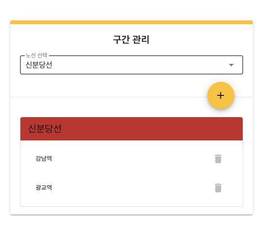

# 2단계 - 인수 테스트 리팩터링

## 1. 요구사항 정의

### 1.1. 명시된 요구사항

#### 1.1.1. 요구사항

##### 1.1.1.0. API 변경 대응하기
- 노선 생성 시 종점역(상행, 하행) 정보를 요청 파라미터에 함께 추가하기
    - 두 종점역은 구간의 형태로 관리되어야 함
- 노선 조회 시 응답 결과에 역 목록 추가하기
    - 상행역 부터 하행역 순으로 정렬되어야 함

##### 1.1.1.1. 변경사항

- 생성
    - 변경된 노선 API - 노선 생성 Request
        ```json
        POST /lines HTTP/1.1
        accept: */*
        content-type: application/json; charset=UTF-8
        
        {
            "color": "bg-red-600",
            "name": "신분당선",
            "upStationId": "1",
            "downStationId": "2",
            "distance": "10"
        }
        ```
- 목록 조회
    - 변경된 노선 API - 지하철 노선 목록 조회 response
        ```json
        HTTP/1.1 200
        Content-Type: application/json
        Date: Fri, 13 Nov 2020 00:11:51 GMT
        
        [
            {
                "id": 1,
                "name": "신분당선",
                "color": "bg-red-600",
                "stations": [
                    {
                        "id": 1,
                        "name": "강남역",
                        "createdDate": "2020-11-13T12:17:03.075",
                        "modifiedDate": "2020-11-13T12:17:03.075"
                    },
                    {
                        "id": 2,
                        "name": "역삼역",
                        "createdDate": "2020-11-13T12:17:03.092",
                        "modifiedDate": "2020-11-13T12:17:03.092"
                    }
                ],
                "createdDate": "2020-11-13T09:11:51.997",
                "modifiedDate": "2020-11-13T09:11:51.997"
            }
        ]
        ```
- 조회
    - 변경된 노선 API - 노선 조회 Response
        ```json
        HTTP/1.1 200 
        Content-Type: application/json
        Date: Fri, 13 Nov 2020 00:11:51 GMT
        
        {
            "id": 1,
            "name": "신분당선",
            "color": "bg-red-600",
            "stations": [
                {
                    "id": 1,
                    "name": "강남역",
                    "createdDate": "2020-11-13T12:17:03.075",
                    "modifiedDate": "2020-11-13T12:17:03.075"
                },
                {
                    "id": 2,
                    "name": "역삼역",
                    "createdDate": "2020-11-13T12:17:03.092",
                    "modifiedDate": "2020-11-13T12:17:03.092"
                }
            ],
            "createdDate": "2020-11-13T09:11:51.997",
            "modifiedDate": "2020-11-13T09:11:51.997"
        }
        ```

##### 1.1.1.2. 요구사항 설명

###### 1.1.1.2.1. 노선 생성 시 두 종점역 추가하기

인수 테스트와 DTO 등 수정이 필요함

```java
public class LineRequest {
    private String name;
    private String color;
    private Long upStationId;       // 추가
    private Long downStationId;     // 추가
    private int distance;           // 추가
    ...
}
```

###### 1.1.1.2.2. 노선 객체에서 구간 정보를 관리하기

노선 생성시 전달되는 두 종점역은 노선의 상태로 관리되는 것이 아니라 구간으로 관리되어야 함

```java
public class Line {
    ...
    private List<Section> sections;
    ...
}
```

###### 1.1.1.2.3. 노선의 역 목록을 조회하는 기능 구현하기

- 노선 조회 시 역 목록을 함께 응답할 수 있도록 변경
- 노선에 등록된 구간을 순서대로 정렬하여 상행 종점부터 하행 종점까지 목록을 응답하기
- 필요시 노선과 구간(혹은 역)의 관계를 새로 맺기

#### 1.1.2. 힌트

##### 1.1.2.1. 기능 변경 시 인수 테스트를 먼저 변경하기

- 기능(혹은 스펙) 변경 시 테스트가 있는 환경에서 프로덕션 코드를 먼저 수정할 경우 어려움을 겪을 수 있음
    - 프로덕션 코드를 수정하고 그에 맞춰 테스트 코드를 수정해 주어야 해서 두번 작업하는 느낌
- 항상 테스트를 먼저 수정한 다음 프로덕션을 수정하자!
- 더 좋은 방법은 기존 테스트는 두고 새로운 테스트를 먼저 만들고 시작하자!

###### 1.1.2.2. 프론트엔드



### 1.2. 기능 요구사항 정리 (**_수정할 것_**)

|구분 | 상세 |구현방법     |
|:----:  |:------  |:---------|
|노선 관리|• 지하철 노선 생성|• `LineAcceptanceTest` 작성<br>• 원시값 포장<br>• `Entity` 변경<br>• `LineGroup` 일급콜렉션 생성<br>• `LineService` 생성 기능 수정<br>• `LineController` 생성 기능 수정|
|노선 관리|• 지하철 노선 목록 조회|• `LineAcceptanceTest` 작성<br>• `LineService` 목록 조회기능 수정<br>• `LineController` 목록 조회 기능|
|노선 관리|• 지하철 노선 조회|• `LineAcceptanceTest` 작성<br>• `LineService` 조회 기능<br>• `LineController` 조회 기능|
|노선 관리|• 지하철 노선 수정|• `LineAcceptanceTest` 작성<br>• `LineService` 수정 기능<br>• `LineController` 수정 기능|
|노선 관리|• 지하철 노선 삭제|• `LineAcceptanceTest` 작성<br>• `LineService` 삭제 기능<br>• `LineController` 삭제 기능|

### 1.3. 프로그래밍 요구사항

|구분|상세|구현 방법|
|:---:|:---|---|
|Convention|• 자바 코드 컨벤션을 지키면서 프로그래밍한다.<br>&nbsp;&nbsp;• https://naver.github.io/hackday-conventions-java/ <br>&nbsp;&nbsp;• https://google.github.io/styleguide/javaguide.html <br>&nbsp;&nbsp;•  https://myeonguni.tistory.com/1596 |- gradle-editorconfig 적용<br>- gradle-checkstyle 적용<br>- IntelliJ 적용<br>- Github 적용|
|테스트|• 모든 기능을 TDD로 구현해 단위 테스트가 존재해야 한다. 단, UI(System.out, System.in) 로직은 제외<br>&nbsp;&nbsp;• 핵심 로직을 구현하는 코드와 UI를 담당하는 로직을 구분한다.<br>&nbsp;&nbsp;•UI 로직을 InputView, ResultView와 같은 클래스를 추가해 분리한다.|- 핵심 로직 단위테스트|

### 1.4. 비기능 요구사항

|구분 |상세 |구현방법     |
|:----:  |:------  |:---------|
|요구사항|• 기능을 구현하기 전에 README.md 파일에 구현할 기능 목록을 정리해 추가한다.|- 요구사항 정의 정리|
|Convention|• git의 commit 단위는 앞 단계에서 README.md 파일에 정리한 기능 목록 단위로 추가한다.<br>&nbsp;&nbsp;• 참고문서 : [AngularJS Commit Message Conventions](https://gist.github.com/stephenparish/9941e89d80e2bc58a153)|- git commit 시 해당 convention 적용|

#### 1.4.1. AngularJS Commit Message Conventions 중

- commit message 종류를 다음과 같이 구분

```
feat (feature)
 fix (bug fix)
 docs (documentation)
 style (formatting, missing semi colons, …)
 refactor
 test (when adding missing tests)
 chore (maintain)
 ```

# 1.4.2. editorConfig setting

```
Execution failed for task ':editorconfigCheck'.
> There are .editorconfig violations. You may want to run

* Try:
Run with --stacktrace option to get the stack trace. Run with --info or --debug option to get more log output. Run with --scan to get full insights.
```

- 위와 같은 에러가 뜨면 다음을 실행한다. `./gradlew editorconfigFormat`

## 2. 분석 및 설계

### 2.1. 이번 Step 핵심 목표

#### 2.1.1. ATDD

> 학습 내용 간단히 정리 [[Markdown 보기]](./summary.md)

### 2.2. Todo List

- [x] 0.기본 세팅
    - [x] 0-1.git fork/clone
        - [x] 0-1-1.NEXTSTEP 내 과제로 이동 및 '미션시작'
        - [x] 0-1-2.실습 github으로 이동
        - [x] 0-1-3.branch 'gregolee'로 변경
        - [x] 0-1-4.fork
        - [x] 0-1-5.clone : `git clone -b gregolee --single-branch https://github.com/gregolee/atdd-subway-admin.git`
        - [x] 0-1-6.branch : `git checkout -b step1`
    - [x] 0-2.요구사항 정리
    - [x] 0-3.[AngularJS Commit Message Conventions](https://gist.github.com/stephenparish/9941e89d80e2bc58a153#generating-changelogmd) 참고
    - [x] 0-4.Slack을 통해 merge가 되는지 확인한 후에 코드 리뷰 2단계 과정으로 다음 단계 미션을 진행
        - [x] 0-4-1.gregolee(master) branch로 체크아웃 : `git checkout gregolee`
        - [x] 0-4-2.step1 branch 삭제 : `git branch -D step1`
        - [x] 0-4-3.step1 branch 삭제 확인 : `git branch -a`
        - [x] 0-4-4.원본(next-step) git repository를 remote로 연결 (미션 당 1회) : `git remote add -t gregolee upstream https://github.com/next-step/atdd-subway-admin`
        - [x] 0-4-5.원본(next-step) git repository를 remote로 연결 확인 : `git remote -v`
        - [x] 0-4-6.원본(next-step) git repository에서 merge된 나의 branch(gregolee)를 fetch : `git fetch upstream gregolee`
        - [x] 0-4-7.remote에서 가져온 나의 branch로 rebase : `git rebase upstream/gregolee`
        - [x] 0-4-7.gregolee -> step2로 체크아웃 : `git checkout -b step2`
    - [ ] 0-5.리뷰어님의 리뷰를 반영한 코드로 수정
        - [x] 0-5-1.강의 자료 학습한 부분만 수정
        - [x] 0-5-2.`body`를 `LineRequest`로 이용하여 요청
        - [ ] 0-5-3.ATDD 네이밍 변경
            - [x] 0-5-3-1.파라메터 명칭 제거토록
            - [x] 0-5-3-2.given, when, then에 해당하는 명칭으로 변경
            - [ ] 0-5-3-3.지하철 노선 생성이라는 말보단 지하철_노선_등록되어_있음등으로 수정
        - [ ] 0-5-4.ATDD 값 검증 추가
        - [ ] 0-5-5.필요없는 `@Transactional`제거
        - [ ] 0-5-6.`LineService.java` 내 찾지 못했을 경우 Custom Exception 발생
        - [ ] 0-5-7.`@ExceptionHandler` 중복 제거
        - [ ] 0-5-8.`validate()` 생성자에 포함하도록 변경
        - [ ] 0-5-9.`LineService.java` : `LineResponse.ofList()` 를 이용해 캡슐화
- [x] 1.자바 코드 컨벤션을 위한 세팅
    - [x] 1-1.[gradle-editorconfig](https://naver.github.io/hackday-conventions-java/#editorconfig) 적용
    - [x] 1-2.[gradle-checkstyle](https://naver.github.io/hackday-conventions-java/#checkstyle) 적용
    - [x] 1-3.[IntelliJ](https://naver.github.io/hackday-conventions-java/#_intellij) 적용
    - [x] 1-4.[Github](https://naver.github.io/hackday-conventions-java/#_github) 적용
- [x] 2.학습
    - [x] 2-1.RestAssured 학습 : [[Usage Guide]](https://github.com/rest-assured/rest-assured/wiki/Usage#examples)
    - [x] 2-2.LiveTemplates - IntelliJ
- [ ] 3.분석 및 설계
    - [x] 3-1.step02.md 초안 작성
    - [ ] 3-2.ATDD 작성
- [ ] 4.구현
    - [ ] 4-1.
        - [ ] 4-1-1.
- [ ] 5.테스트
    - [ ] 5-1.Gradle build Success 확인
    - [ ] 5-2.checkstyle 문제없는지 확인 (Java Convention)
    - [ ] 5-3.요구사항 조건들 충족했는지 확인
        - [ ] 5-3-1.핵심 단위 로직 테스트
    - [ ] 5-4.인수 테스트 확인
    - [ ] 5-5.UI 테스트 확인
- [ ] 6.인수인계
    - [ ] 6-1.소감 및 피드백 정리
        - [ ] 6-1-1.느낀점 & 배운점 작성
        - [ ] 6-1-2.피드백 요청 정리
    - [ ] 6-2.코드리뷰 요청 및 피드백
        - [ ] 6-1-1.step2를 gregolee/atdd-subway-admin로 push : `git push origin step2`
        - [ ] 6-1-2.pull request(PR) 작성
    - [ ] 6-3.Slack을 통해 merge가 되는지 확인한 후에 미션 종료

### 2.3. ATDD 작성

ATDD 작성 [Markdown 보기](./atdd.md)

## 3. 인수인계

### 3.1. 느낀점 & 배운점

#### 3.1.1. 느낀점

- 

#### 3.1.2. 배운점

- 

### 3.2. 피드백 요청

- 