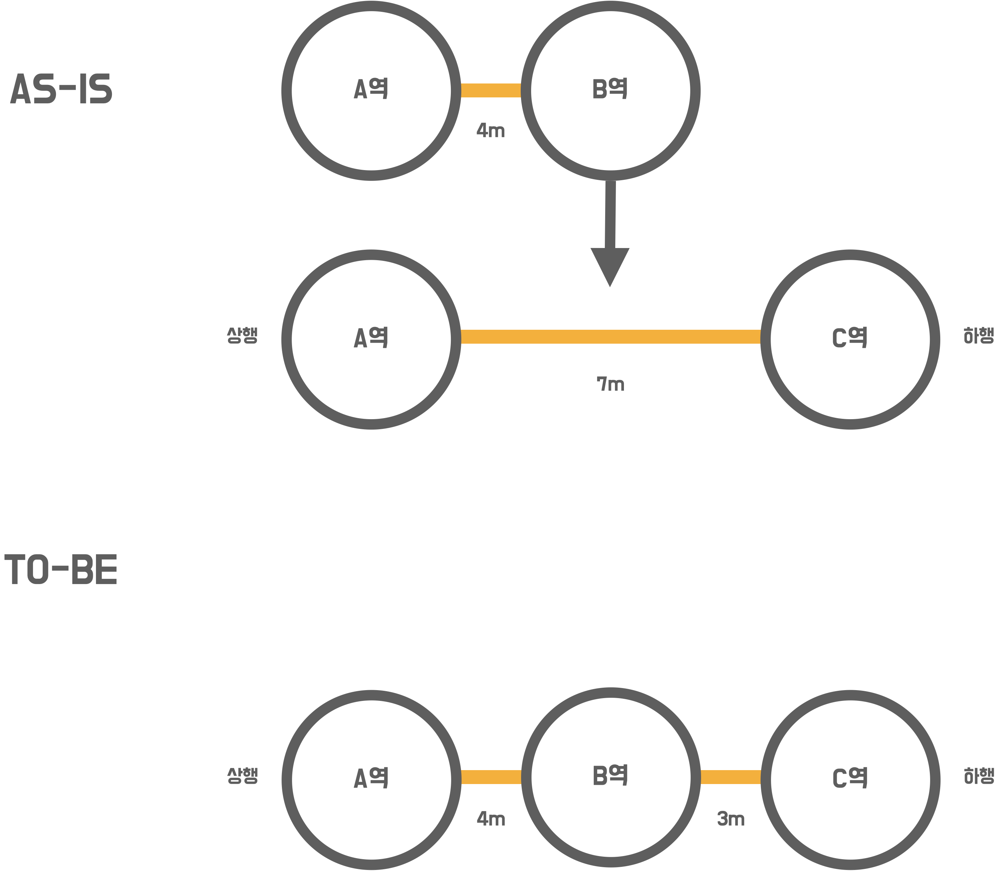
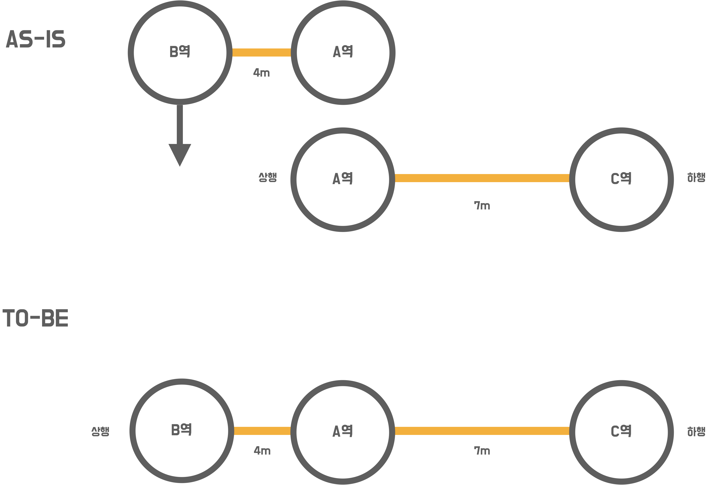
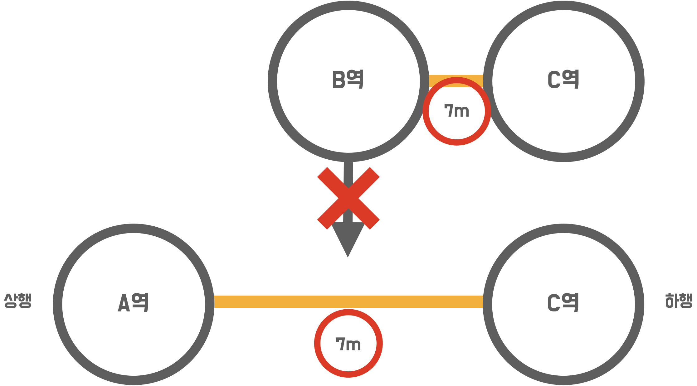
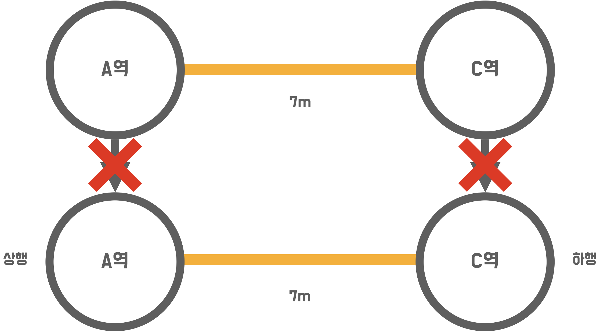
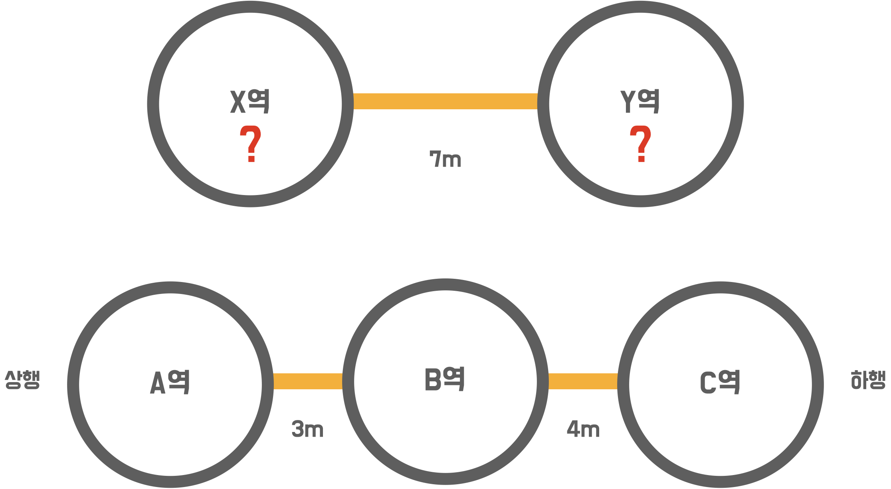

# 3단계 - 구간 추가 기능

## 1. 요구사항 정의

### 1.1. 명시된 요구사항

#### 1.1.1. 요구사항

##### 1.1.1.0. 지하철 구간 등록 기능을 구현하기

- 기능 구현 전 인수 테스트 작성
- 예외 케이스 처리 인수 테스트 작성

##### 1.1.1.1. 추가 사항

- 구간 등록
    - 구간 등록 API Request
        ```json
        POST /lines/1/sections HTTP/1.1
        accept: */*
        content-type: application/json; charset=UTF-8
        host: localhost:52165
        
        {
            "downStationId": "4",
            "upStationId": "2",
            "distance": 10
        }
        ```

##### 1.1.1.2. 요구사항 설명

###### 1.1.1.2.1. 지하철 구간 등록 인수 테스트 작성과 기능 구현

1. 역 사이에 새로운 역을 등록할 경우
    - 새로운 길이를 뺀 나머지를 새롭게 추가된 역과의 길이로 설정
    


2. 새로운 역을 상행 종점으로 등록할 경우



3. 새로운 역을 하행 종점으로 등록할 경우


###### 1.1.1.2.2. 구간 등록 시 예외 케이스를 고려하기

1. 역 사이에 새로운 역을 등록할 경우 기존 역 사이 길이보다 크거나 같으면 등록을 할 수 없음



2. 상행역과 하행역이 이미 노선에 모두 등록되어 있다면 추가할 수 없음
    - 아래의 이미지 에서 A-B, B-C 구간이 등록된 상황에서 B-C 구간을 등록할 수 없음(A-C 구간도 등록할 수 없음)



3. 상행역과 하행역 둘 중 하나도 포함되어있지 않으면 추가할 수 없음



#### 1.1.2. 힌트

##### 1.1.2.1. 구간 등록 인수 테스트

1. SectionAcceptanceTest 예시

    ```java
    @DisplayName("노선에 구간을 등록한다.")
    @Test
    void addSection() {
    // when
    // 지하철_노선에_지하철역_등록_요청
    
        // then
        // 지하철_노선에_지하철역_등록됨
    }
    ```

2. @BeforeEach
    - BeforeEach 애너테이션을 이용하면 테스트 클래스의 테스트 메서드 실행 전 실행
    - given 절에 대한 중복 코드를 제거할 수 있음
    ```java
    @BeforeEach
    public void setUp() {
        super.setUp();
    
        // given
        강남역 = StationAcceptanceTest.지하철역_등록되어_있음("강남역").as(StationResponse.class);
        광교역 = StationAcceptanceTest.지하철역_등록되어_있음("광교역").as(StationResponse.class);
    
        createParams = new HashMap<>();
        createParams.put("name", "신분당선");
        createParams.put("color", "bg-red-600");
        createParams.put("upStation", 강남역.getId() + "");
        createParams.put("downStation", 광교역.getId() + "");
        createParams.put("distance", 10 + "");
        신분당선 = 지하철_노선_등록되어_있음(createParams).as(LineResponse.class);
    }
    ```

3. SectionRequest 예시

    ```java
    public class SectionRequest {
        private Long upStationId;         // 상행역 아이디
        private Long downStationId;       // 하행역 아이디
        private int distance;             // 거리
    
        ...
   }
    ```

###### 1.1.2.2. 구간 등록 기능 구현

1. LineController 예시

    ```java
    ...
    @PostMapping("/{lineId}/sections")
    public ResponseEntity addSection(
            @PathVariable Long lineId,
            @RequestBody SectionRequest sectionRequest) {
        // TODO: 구간 등록 기능 구현
        // ...
    }
    ...
    ```

2. 기능 구현 팁
    - 세부적인 예외 상황을 고려하지 않고 Happy Path 경우를 검증하기 위한 인수 테스트를 먼저 만드세요.
      
    > "Happy Path"는 '아무것도 잘못되지 않는 사용자 시나리오'를 의미한다 (All-Pass Scenario / Positive Test). 이는 사람의 실수, 엣지 케이스, 의도를 벗어난 행동을 포함하지 않기 때문에 이 시나리오 대로 테스트를 수행하면 이슈나 버그가 발생할 가능성이 현저히 낮아진다.

###### 1.1.2.3. JPA 관계 맵핑

- 지하철역은 여러개의 지하철 노선에 포함될 수 있다.
    - ex) 강남역은 2호선에 등록되어 있는 동시에 신분당선에 등록되어 있음
- 따라서 다대다 관계로 보아 @ManyToMany로 관계를 맺을 수 있음
- 하지만 다대다 관계는 여러가지 예상치 못한 문제를 발생시킬 수 있어 추천하지 않음
    - https://ict-nroo.tistory.com/127 블로그를 참고하세요
- 지하철역과 지하철 노선의 맵핑 테이블을 엔티티로 두는 방법을 추천
    - 기존에 Station과 Line이 있었다면 Line에 속하는 Station을 LineStation이라는 엔티티로 도출
    - Line과 LineStation을 @ManyToOne 관계로 설정
- 참고할 코드:
    - https://github.com/next-step/atdd-subway-map/blob/boorownie/src/main/java/nextstep/subway/line/domain/LineStations.java
    - 참고한 코드에서는 LineStation을 일급컬렉션을 묶어 LineStations로 둠
    - JPA @Embedded And @Embeddable을 참고하세요.

### 1.2. 기능 요구사항 정리

|구분 | 상세 |구현방법     |
|:----:  |:------  |:---------|
|구간 추가|• Hppay Path|• 역 사이에 새로운 역을 등록할 경우<br>• 새로운 역을 상행 종점으로 등록할 경우<br>• 새로운 역을 하행 종점으로 등록할 경우|
|구간 추가|• 예외 케이스 고려하기|• 역 사이에 새로운 역을 등록할 경우 기존 역 사이 길이보다 크거나 같으면 등록을 할 수 없음<br>• 상행역과 하행역이 이미 노선에 모두 등록되어 있다면 추가할 수 없음<br>• 상행역과 하행역 둘 중 하나도 포함되어있지 않으면 추가할 수 없음|

### 1.3. 프로그래밍 요구사항

|구분|상세|구현 방법|
|:---:|:---|---|
|Convention|• 자바 코드 컨벤션을 지키면서 프로그래밍한다.<br>&nbsp;&nbsp;• https://naver.github.io/hackday-conventions-java/ <br>&nbsp;&nbsp;• https://google.github.io/styleguide/javaguide.html <br>&nbsp;&nbsp;•  https://myeonguni.tistory.com/1596 |- gradle-editorconfig 적용<br>- gradle-checkstyle 적용<br>- IntelliJ 적용<br>- Github 적용|
|테스트|• 모든 기능을 TDD로 구현해 단위 테스트가 존재해야 한다. 단, UI(System.out, System.in) 로직은 제외<br>&nbsp;&nbsp;• 핵심 로직을 구현하는 코드와 UI를 담당하는 로직을 구분한다.<br>&nbsp;&nbsp;•UI 로직을 InputView, ResultView와 같은 클래스를 추가해 분리한다.|- 핵심 로직 단위테스트|

### 1.4. 비기능 요구사항

|구분 |상세 |구현방법     |
|:----:  |:------  |:---------|
|요구사항|• 기능을 구현하기 전에 README.md 파일에 구현할 기능 목록을 정리해 추가한다.|- 요구사항 정의 정리|
|Convention|• git의 commit 단위는 앞 단계에서 README.md 파일에 정리한 기능 목록 단위로 추가한다.<br>&nbsp;&nbsp;• 참고문서 : [AngularJS Commit Message Conventions](https://gist.github.com/stephenparish/9941e89d80e2bc58a153)|- git commit 시 해당 convention 적용|

#### 1.4.1. AngularJS Commit Message Conventions 중

- commit message 종류를 다음과 같이 구분

```
feat (feature)
 fix (bug fix)
 docs (documentation)
 style (formatting, missing semi colons, …)
 refactor
 test (when adding missing tests)
 chore (maintain)
 ```

# 1.4.2. editorConfig setting

```
Execution failed for task ':editorconfigCheck'.
> There are .editorconfig violations. You may want to run

* Try:
Run with --stacktrace option to get the stack trace. Run with --info or --debug option to get more log output. Run with --scan to get full insights.
```

- 위와 같은 에러가 뜨면 다음을 실행한다. `./gradlew editorconfigFormat`

## 2. 분석 및 설계

### 2.1. 이번 Step 핵심 목표

#### 2.1.1. ATDD

> 학습 내용 간단히 정리 [[Markdown 보기]](./summary.md)

### 2.2. Todo List

- [x] 0.기본 세팅
    - [x] 0-1.git fork/clone
        - [x] 0-1-1.NEXTSTEP 내 과제로 이동 및 '미션시작'
        - [x] 0-1-2.실습 github으로 이동
        - [x] 0-1-3.branch 'gregolee'로 변경
        - [x] 0-1-4.fork
        - [x] 0-1-5.clone : `git clone -b gregolee --single-branch https://github.com/gregolee/atdd-subway-admin.git`
        - [x] 0-1-6.branch : `git checkout -b step1`
    - [x] 0-2.요구사항 정리
    - [x] 0-3.[AngularJS Commit Message Conventions](https://gist.github.com/stephenparish/9941e89d80e2bc58a153#generating-changelogmd) 참고
    - [x] 0-4.Slack을 통해 merge가 되는지 확인한 후에 코드 리뷰 3단계 과정으로 다음 단계 미션을 진행
        - [x] 0-4-1.gregolee(master) branch로 체크아웃 : `git checkout gregolee`
        - [x] 0-4-2.step1 branch 삭제 : `git branch -D step2`
        - [x] 0-4-3.step1 branch 삭제 확인 : `git branch -a`
        - [x] 0-4-4.원본(next-step) git repository를 remote로 연결 (미션 당 1회) : `git remote add -t gregolee upstream https://github.com/next-step/atdd-subway-admin`
        - [x] 0-4-5.원본(next-step) git repository를 remote로 연결 확인 : `git remote -v`
        - [x] 0-4-6.원본(next-step) git repository에서 merge된 나의 branch(gregolee)를 fetch : `git fetch upstream gregolee`
        - [x] 0-4-7.remote에서 가져온 나의 branch로 rebase : `git rebase upstream/gregolee`
        - [x] 0-4-7.gregolee -> step3로 체크아웃 : `git checkout -b step3`
    - [x] 0-5.리뷰어님의 리뷰를 반영한 코드로 수정
        - [x] 0-5-1.`SectionGroup.java` : `FetchType.EAGER` -> `FetchType.LAZY`
        - [x] 0-5-2.`SectionGroup.java` : `findSectionIndexWithinUpStations()` 객체에 메시지를 보내 비교해보기
        - [x] 0-5-2.`SectionService.java` : 불필요하다면 해당 서비스를 제거한다.
- [x] 1.자바 코드 컨벤션을 위한 세팅
    - [x] 1-1.[gradle-editorconfig](https://naver.github.io/hackday-conventions-java/#editorconfig) 적용
    - [x] 1-2.[gradle-checkstyle](https://naver.github.io/hackday-conventions-java/#checkstyle) 적용
    - [x] 1-3.[IntelliJ](https://naver.github.io/hackday-conventions-java/#_intellij) 적용
    - [x] 1-4.[Github](https://naver.github.io/hackday-conventions-java/#_github) 적용
- [x] 2.학습
    - [x] 2-1.이번 단계에는 없습니다.
- [x] 3.분석 및 설계
    - [x] 3-1.step03.md 초안 작성
    - [x] 3-2.ATDD 작성
- [x] 4.구현
    - [x] 4-1.HappyPath
        - [x] 4-1-1.Scenario: 지하철 노선 내 역 사이에 상행역 기준으로 새로운 역을 등록한다.
        - [x] 4-1-2.Scenario: 지하철 노선 내 역 사이에 하행역 기준으로 새로운 역을 등록한다.
        - [x] 4-1-3.Scenario: 지하철 노선 내 새로운 역을 상행 종점으로 등록한다.
        - [x] 4-1-4.Scenario: 지하철 노선 내 새로운 역을 하행 종점으로 등록한다.
    - [x] 4-2.Exception
        - [x] 4-2-1.Scenario: 역 사이에 새로운 역을 등록할 경우 기존 역 사이 길이보다 크거나 같으면 등록을 할 수 없다.
        - [x] 4-2-2.Scenario: 상행역과 하행역이 이미 노선에 모두 등록되어 있다면 추가할 수 없다.
        - [x] 4-2-3.Scenario: 상행역과 하행역 둘 중 하나도 포함되어있지 않으면 추가할 수 없다.
- [x] 5.테스트
    - [x] 5-1.Gradle build Success 확인
    - [x] 5-2.checkstyle 문제없는지 확인 (Java Convention)
    - [x] 5-3.요구사항 조건들 충족했는지 확인
        - [x] 5-3-1.핵심 단위 로직 테스트 
    - [x] 5-4.인수 테스트 확인
    - [x] 5-5.UI 테스트 확인
- [ ] 6.인수인계
    - [ ] 6-1.소감 및 피드백 정리
        - [ ] 6-1-1.느낀점 & 배운점 작성
        - [ ] 6-1-2.피드백 요청 정리
    - [ ] 6-2.코드리뷰 요청 및 피드백
        - [ ] 6-1-1.step3를 gregolee/atdd-subway-admin로 push : `git push origin step3`
        - [ ] 6-1-2.pull request(PR) 작성
    - [ ] 6-3.Slack을 통해 merge가 되는지 확인한 후에 미션 종료

### 2.3. ATDD 작성

ATDD 작성 [Markdown 보기](./atdd.md)

## 3. 인수인계

### 3.1. 느낀점 & 배운점

#### 3.1.1. 느낀점

- 

#### 3.1.2. 배운점

- 

### 3.2. 피드백 요청

- 