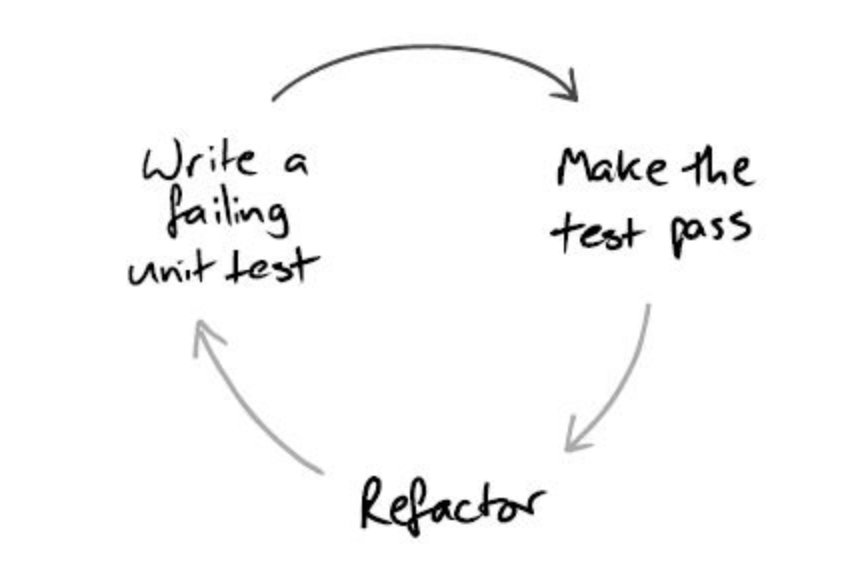
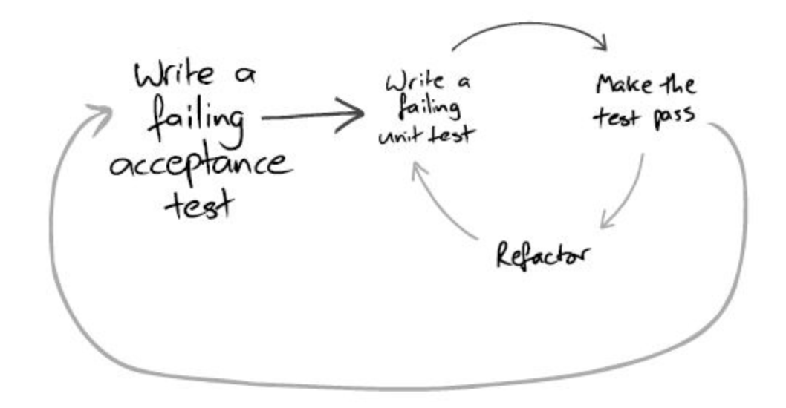
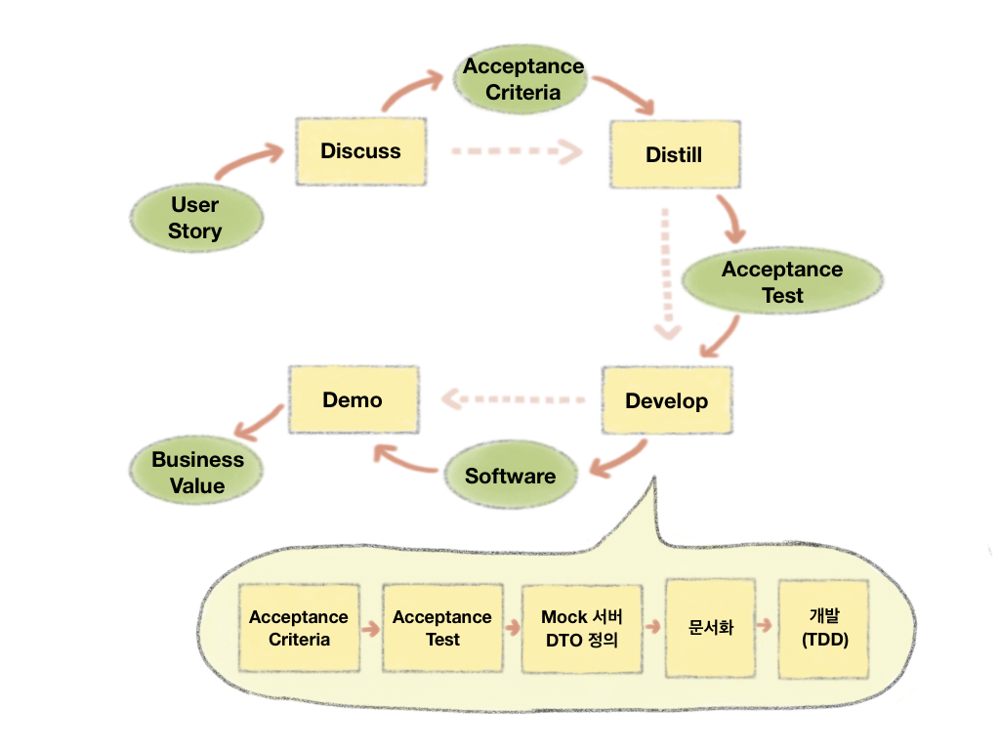

# ATDD

> 우아한테크캠프 Pro 2기 내용을 정리했습니다.
> - 저작권에 따라 문제가 되는 사항이 있다면 연락하시어 해당 내용을 변경, 제거토록 하겠습니다.

## 1. 개요

### 1.1. TDD Cycle



- 도메인에 대한 이해도 부족 -> 단위 테스트 작성이 어려움
- 객체 설계의 어려움 -> TDD Cycle 진행 어려움
    - 경험이 부족한 경우 더욱더 막막해진다.
    - 내가 어디쯤 진행하고 있고, 잘하고 있는지 의문이 든다.
- 나무만 보고 숲을 보지 못하는 경우가 발생한다.

### 1.2. 인수테스트 주도 개발(ATDD)

> TDD의 단점을 보완하기 위해 인수 테스트(acceptance test)를 먼저 구현한 후 이후 단위 테스트를 통해 기능을 완성해 가는 과정으로 애플리케이션을 개발


- 애자일 방법 중 하나 : 다양한 관점을 가진 팀원(기획, 개발, 테스터 등)들과 협업을 위함
- 위 그림 중 두번째 그림처럼 커뮤니케이션 없이 진행하다보면 결과물이 나온 시점에서 결과물이 다르게 나올 수 있다.
- ATDD는 이러한 리스크를 사전에 방지하고, 기획 단계부터 인수 테스트(acceptance test)를 통해 공통의 이해를 도모하여 프로젝트를 진행한다.

### 1.3. ATDD Cycle

> [Acceptance Test Driven Development](https://mysoftwarequality.wordpress.com/2013/11/12/when-something-works-share-it/)




### 1.4. ATDD Process


#### 1.4.1. 요구사항(인수 조건)

> [Acceptance Criteria: Purposes, Formats, and Best Practices](https://www.altexsoft.com/blog/business/acceptance-criteria-purposes-formats-and-best-practices/)

- 인수테스트(acceptance test)가 충족해야할 조건
    - 기술 용어가 사용되지 않고 일반 사용자들이 이해할 수 있는 단어를 사용한다.
- 인수 조건을 표현하는 것은 다음과 같이 있다.
    - 시나리오 : scenario-oriented (the Given/When/Then template) 
    - 룰 : rule-oriented (the checklist template)
    - 커스텀 : custom formats
  
#### 1.4.2. 인수테스트(acceptance test)

- 사용자의 관점에서 올바르게 작동하는지 확인하는 테스트
- 
  - 실제 request/response 환경과 유사하게 테스트 환경을 구성한다.

#### 1.4.3. 문서화

- API 문서화 (Spring Rest Docs 등)
  - 문서화를 위해서 Mock 서버 및 DTO 정의가 필요하다.
- 다른 개발자들과 협업 시 의사소통에 큰 장점
  - Front-end, Back-end 개발자들 간 작업하는데 유리하다.
- 인수테스트와는 별개로 API 테스트를 수행한다.

> API 설계
>   - 요구사항에 맞는 API 설계 고민 필요
>   - 각 요청/응답에 맞는 표현 방법에 대한 규칙을 정해야함
>   - 규칙을 정할 때 RFC 문서를 기준으로 할 수 있음
> <br>
> <br>
>   -  고려 대상
>       -  method
>       -  uri(url)
>       -  header
>       -  status code
>       -  payload body

#### 1.4.4. TDD(기능 구현)

- 인수테스트 기반으로 기능 구현함

## 2. 인수 테스트 도구

### 2.1. 인수 테스트(acceptance test)

#### 2.1.1. 특징

- 전구간 테스트 : 요청/응답 기준으로 전 구간을 검증한다.
- Black Box 테스트 : 세부 구현에 영향을 받지 않게 구현.

#### 2.1.2. 인수 테스트 vs. 통합 테스트
|     |인수테스트|통합테스트|
|:---:| :---: | :---: |
|대상  |해당 시스템 전체|통합 모듈|
|어떻게 |Black Box|Gray Box|

## 2.2. 테스트 만들기

### 2.2.1. 테스트 환경 구축

- 시스템 외부에서 요청하는 방식
  - 시스템 내부 코드를 가능한 호출하지 않음
  - 시스템 전 구간을 테스트하도록 안내
  
### 2.2.2. 인수 테스트 클래스

- 실제 서버가 아닌 테스트를 위한 서버를 로드하도록 한다.
    - 인수 테스트의 request를 받기 위함
    - `@SpringBootTest`를 클래스에 붙여준다.
        - 테스트에 사용할 ApplicationContext를 쉽게 지정하게 도와준다.
            - SpringApplication에서 사용하는 ApplicationContext를 생성해서 작동 -> 생성해서 작동하기 때문에 실제 환경과 동일하게 동작 + 실제 환경과 분리 목표 달성
            - @ContextConfiguration의 발전된 기능
        - `webEnvironment` 설정을 통해 웹 서버의 환경을 지정한다.
            > 테스트 서버의 실행 방법을 설정 - [25.3. Testing Spring Boot Applications](https://docs.spring.io/spring-boot/docs/2.2.6.RELEASE/reference/html/spring-boot-features.html#boot-features-testing-spring-boot-applications) 참조
            - MOCK : Mocking된 웹 환경을 제공, MockMvc를 사용한 테스트를 진행할 수 있음
            - **RANDOM_PORT** : 실제 웹 환경을 구성 (해당 구성 추천. 포트가 변경될 수 있는 환경을 고려하여 한다.)
            - DEFINED_PORT : 실제 웹 환경을 구성, 지정한 포트를 listen
            - NONE : 아무런 웹 환경을 구성하지 않음
  
```java
@SpringBootTest(webEnvironment = SpringBootTest.WebEnvironment.RANDOM_PORT)
public class UserAcceptanceTest {
    ...
}
```

### 2.2.3. 인수 테스트 객체

- 테스트를 위한 서버에 요청을 보내기 위한 클라이언트 객체 설정
    - 테스트의 성격에 맞는 클라이언트를 선택
        - MockMvc 
            - @SpringBootTest의 webEnvironment.MOCK과 함께 사용 가능
            - mocking 된 web environment(ex tomcat) 환경에서 테스트
        - WebTestClient 
            - @SpringBootTest의 webEnvironment.RANDOM_PORT 나 DEFINED_PORT와 함께 사용
            - Netty를 기본으로 사용
        - RestAssured
            - 실제 web environment(Apache Tomcat)을 사용하여 테스트
  
```java
@SpringBootTest(webEnvironment = SpringBootTest.WebEnvironment.RANDOM_PORT)
public class UserAcceptanceTest {
    @LocalServerPort
    int port;
  
    @BeforeEach
    public void setUp() {
      RestAssured.port = port;
    }
    ...
}
```

### 2.2.4. 테스트 서버에 Request

```java
@Test
void generate() {
    //given
    Map<String, String> params = new HashMap<>();
    params.put("userId", "invinciblefunc");
    params.put("name", "이재영");
        
    //when
    ExtractableResponse<Response> response = RestAssured.given().log().all()
        .body(params)
        .contentType(MediaType.APPLICATION_JSON_VALUE)
        .when()
        .post("/user")
        .then().log().all()
        .extract();    
    ...
}
```

### 2.2.5. 응답 결과 검증

#### 2.2.5.1. RestAssured

- REST-assured는 REST API의 테스트 및 검증을 단순화하도록 설계
- HTTP 작업에 대한 검증을 위한 풍부한 API 활용 가능하다.

```java
@Test
void generate() {
    ...
    RestAssured.given().log().all()
        .body(params)
        .contentType(MediaType.APPLICATION_JSON_VALUE)
        .when()
        .post("/user")
        .then().log().all()
        .statusCode(HttpStatus.CREATED.value())
        .header("Location", notNullValue());
}
```

#### 2.2.5.2. AssertJ

```java
@Test
void generate() {
    ...
    ExtractableResponse<Response> response = RestAssured.given().log().all()
        .body(params)
        .contentType(MediaType.APPLICATION_JSON_VALUE)
        .when()
        .post("/user")
        .then().log().all()
        .extract();

    // then
    assertThat(response.statusCode()).isEqualTo(HttpStatus.CREATED.value());
    assertThat(response.header("userId")).isEqualTo("invinciblefunc");
    assertThat(response.header("name")).isEqualTo("이재영");
}
```

### 2.2.6. 이외의 도구들

#### 2.2.6.1. JsonPath

> [JsonPath 사이트](https://github.com/json-path/JsonPath) 참조
 
#### 2.2.6.2. 데이터베이스 초기화

- 고려사항
  - 모든 테이블 조회
  - 모든 테이블 Truncate
  - autoincrement '1'로 복구
  
#### 2.2.6.3. @GetMapping

- produces : accept 헤더의 값에 따라 매핑 여부를 판단
- consumes : content-type 헤더의 값에 따라 매핑 여부를 판단

### 2.2.7. 인수 조건 작성법

- Feature: 간략한 기능 서술
- Background: 각 시나리오 사전 조건
- Scenario: 시나리오(예시) 제목
- Given: 사전조건
- When: 발생해야하는 이벤트
- Then: 사후조건
- And: 앞선 내용에 추가적인 내용 기술

#### 2.2.7.1. 작성팁

- 인수 테스트 클래스
    - Feature 기준으로 인수 테스트 클래스를 나눌 수 있음
    - Scenario 기준으로 인수 테스트 메서드를 작성할 수 있음
    - 하나의 Feature 내부에 있는 Scenario는 같은 테스트 Feature 를 공유 추천
- 간단한 성공 케이스 우선 작성
    - **'지나치게 간단'** 이 아님
    - 동작 가능한 가장 간단한 성공 케이스로 시작
    - 테스트가 동작하면 실제 구조에 관해 더 좋은 생각이 떠오를 수 있음
    - 그 과정에서 발생 가능한 실패를 처리하는것과 성공 케이스 사이에서 우선순위를 가늠
- 실패하는 테스트 지켜보기
    - 코드를 작성하기 전 테스트가 실패하는 것을 지켜본 후 진단 메시지를 확인
    - 테스트가 예상과 다른 식으로 실패하면 뭔가를 잘못 이해했거나 코드가 완성되지 않았다는 뜻
- Given / When / Then
    - When -> Then -> Given 순서로 작성하는 것이 자연스러움
  
#### 2.2.8. 리팩터링

1. 테스트 의도 명확히 드러내기
2. 가독성을 중요히 여겨라
3. 테스트 코드 중복 제거
    - 메서드 분리
    - CRUD 추상화
    - BDD 도구 사용
