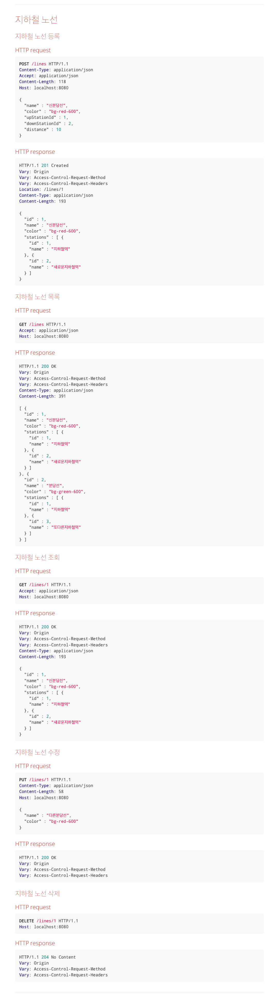

# 2단계 - 지하철 노선 기능

## 요구사항

---

### 기능 요구사항
- **요구사항 설명**에서 제공되는 인수 조건을 기반으로 지하철 노선 관리 기능을 구현하세요.
- 인수 조건을 검증하는 인수 테스트를 작성하세요

### 프로그래밍 요구사항
- 아래의 순서로 기능을 구현하세요.
  - 인수 조건을 검증하는 인수 테스트 작성
  - 인수 테스트를 충족하는 기능 구현
- 인수 테스트의 결과가 다른 인수 테스트에 영향을 끼치지 않도록 인수 테스트를 서로 격리 시키세요.
- 인수 테스트의 재사용성과 가독성, 그리고 빠른 테스트 의도 파악을 위해 인수 테스트를 리팩터링 하세요.
---
### 요구사항 설명
#### 인수 조건
지하철노선 생성
```
When 지하철 노선을 생성하면
Then 지하철 노선 목록 조회 시 생성한 노선을 찾을 수 있다
```
지하철노선 목록 조회
```
Given 2개의 지하철 노선을 생성하고
When 지하철 노선 목록을 조회하면
Then 지하철 노선 목록 조회 시 2개의 노선을 조회할 수 있다.
```
지하철노선 조회
```
Given 지하철 노선을 생성하고
When 생성한 지하철 노선을 조회하면
Then 생성한 지하철 노선의 정보를 응답받을 수 있다.
```
지하철노선 수정
```
Given 지하철 노선을 생성하고
When 생성한 지하철 노선을 수정하면
Then 해당 지하철 노선 정보는 수정된다
```
지하철노선 삭제
```
Given 지하철 노선을 생성하고
When 생성한 지하철 노선을 삭제하면
Then 해당 지하철 노선 정보는 삭제된다
```
<details markdown="1">
<summary>api 명세</summary>



</details>

##구현 목록

- [x] Line 요청, 응답 dto
- [ ] LineController, LineService
  - [x] 생성 api
  - [x] 전체 조회 api
  - [x] 단건 조회 api
  - [x] 수정 api
  - [ ] 삭제 api
- [x] Line 엔티티 매핑
