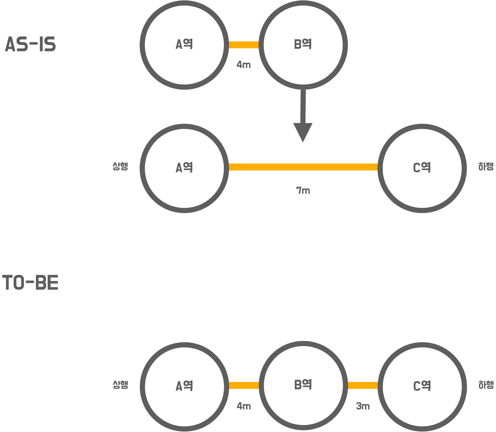
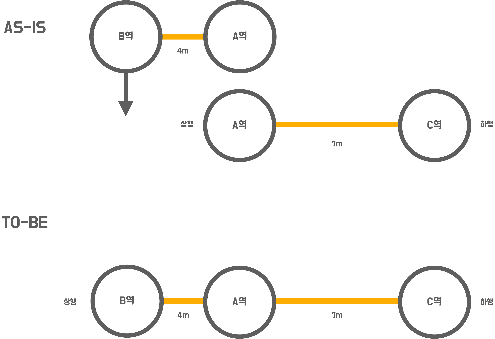
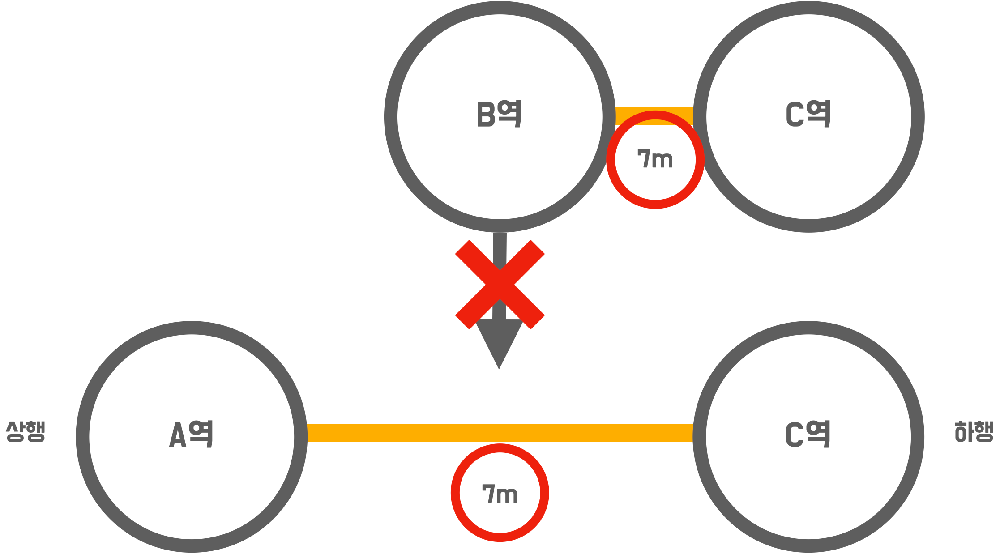

# 🚀 3단계 - 구간 추가 기능

## 기능 요구사항
- `요구사항 설명`에서 제공되는 요구사항을 기반으로 **지하철 구간 추가 기능**을 구현하세요.
- 요구사항을 정의한 **인수 조건**을 조출하세요.
- 인수 조건을 검증하는 **인수 테스트**를 작성하세요.
- 예외 케이스에 대한 검증도 포함하세요.

## 프로그래밍 요구사항
- 인수 테스트 주도 개발 프로세스에 맞춰서 기능을 구현하세요.
  - 요구사항 설명을 참고하여 인수 조건을 정의
  - 인수 조건을 검증하는 인수 테스트 작성
  - 인수 테스트를 충족하는 기능 구현
- 인수 조건은 인수 테스트 메서드 상단에 주석으로 작성하세요.
  - 뼈대 코드의 인수 테스트를 참고
- 인수 테스트의 결과가 다른 인수 테스트에 영향을 끼치지 않도록 인수 테스트를 서로 격리 시키세요.
- 인수 테스트의 재사용성과 가독성, 그리고 빠른 테스트 의도 파악을 위해 인수 테스트를 리팩터링 하세요.

## 요구사항 설명
### 지하철 구간 등록 인수 테스트 작성과 기능 구현
- **역 사이에 새로운 역을 등록할 경우**
  - 새로운 길이를 뺀 나머지를 새롭게 추가된 역과의 길이로 설정
  

- **새로운 역을 상행 종점으로 등록할 경우**
  

- **새로운 역을 하행 종점으로 등록할 경우**
  

### 구간 등록 시 예외 케이스를 고려하기
- **역 사이에 새로운 역을 등록할 경우 기존 역 사이 길이보다 크거나 같으면 등록을 할 수 없음**
  

- **상행역과 하행역이 이미 노선에 모두 등록되어 있다면 추가할 수 없음**
  - 아래의 이미지 에서 A-B, B-C 구간이 등록된 상황에서 B-C 구간을 등록할 수 없음(A-C 구간도 등록할 수 없음)
  

- **상행역과 하행역 둘 중 하나도 포함되어있지 않으면 추가할 수 없음**
  

### 기능 구현 팁
세부적인 예외 상황을 고려하지 않고 Happy Path 경우를 검증하기 위한 인수 테스트를 먼저 만드세요.
"Happy Path"는 '아무것도 잘못되지 않는 사용자 시나리오'를 의미한다(All-Pass Scenario / Positive Test).
이는 사람의 실수, 엣지 케이스, 의도를 벗어난 행동을 포함하지 않기 때문에 이 시나리오 대로 테스트를 수행하면 이슈나 버그가 발생할 가능성이 현저히 낮아진다.

### JPA 관계 매핑
- 지하철역은 여러개의 지하철 노선에 포함될 수 있다.
  - ex) 강남역은 2호선에 등록되어 있는 동시에 신분당선에 등록되어 있음
- 따라서 다대다 관계로 보아 @ManyToMany로 관계를 맺을 수 있음
- 하지만 다대다 관계는 여러가지 예상치 못한 문제를 발생시킬 수 있어 추천하지 않음
  -https://ict-nroo.tistory.com/127 블로그를 참고하세요
- 지하철역과 지하철 노선의 맵핑 테이블을 엔티티로 두는 방법을 추천
  - 기존에 Station과 Line이 있었다면 Line에 속하는 Station을 LineStation이라는 엔티티로 도출
  - Line과 LineStation을 @ManyToOne 관계로 설정
- 참고할 코드:
  - https://github.com/next-step/atdd-subway-map/blob/boorownie/src/main/java/nextstep/subway/line/domain/LineStations.java
  - 참고한 코드에서는 LineStation을 일급컬렉션을 묶어 LineStations로 둠
  - JPA @Embedded And @Embeddable을 참고하세요.

### 📚 TODO LIST 📚
- [x] 인수 조건 작성
- [x] 인수 테스트 작성
- [x] 역 사이에 새로운 구간 추가시 노선에서 조회가능
- [x] 상행선에 새로운 구간 추가시 노선 첫 번째에서 조회가능
- [x] 하행선에 새로운 구간 추가시 노선 마지막에서 조회가능
- [x] 역 사이 길이보다 같거나 큰 새로운 구간은 등록불가
- [x] 기존에 있는 구간 추가시 등록불가
- [x] 상 하행선 모두 해당 노선이 아닌 구간 추가시 등록불가
