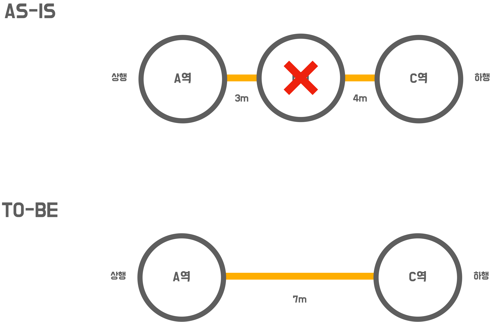

# 🚀 4단계 - 구간 추가 기능

## 기능 요구사항
- `요구사항 설명`에서 제공되는 요구사항을 기반으로 **지하철 구간 제거 기능**을 구현하세요.
- 요구사항을 정의한 **인수 조건**을 조출하세요.
- 인수 조건을 검증하는 **인수 테스트**를 작성하세요.
- 예외 케이스에 대한 검증도 포함하세요.

## 프로그래밍 요구사항
- **인수 테스트 주도 개발 프로세스**에 맞춰서 기능을 구현하세요.
  - `요구사항 설명`을 참고하여 인수 조건을 정의
  - 인수 조건을 검증하는 인수 테스트 작성
  - 인수 테스트를 충족하는 기능 구현
- 인수 조건은 인수 테스트 메서드 상단에 주석으로 작성하세요.
  - 뼈대 코드의 인수 테스트를 참고
- 인수 테스트의 결과가 다른 인수 테스트에 영향을 끼치지 않도록 인수 테스트를 서로 격리 시키세요.
- 인수 테스트의 재사용성과 가독성, 그리고 빠른 테스트 의도 파악을 위해 인수 테스트를 리팩터링 하세요.

## 요구사항 설명
### 노선의 구간을 제거하는 기능을 구현하기
- 종점이 제거될 경우 다음으로 오던 역이 종점이 됨
- 중간역이 제거될 경우 재배치를 함
  - 노선에 A - B - C 역이 연결되어 있을 때 B역을 제거할 경우 A - C로 재배치 됨
  - 거리는 두 구간의 거리의 합으로 정함

### 구간 삭제 시 예외 케이스를 고려하기
- 기능 설명을 참고하여 예외가 발생할 수 있는 경우를 검증할 수 있는 인수 테스트를 만들고 이를 성공 시키세요.
  - 예시) 노선에 등록되어있지 않은 역을 제거하려 한다.
  - 구간이 하나인 노선에서 마지막 구간을 제거할 때
    - 제거할 수 없음

### 📚 TODO LIST 📚
- [x] 인수 조건 작성
- [x] 리뷰 사항 반영
- [x] 인수 테스트 작성
- [x] 구간을 제거하면 해당 역을 찾을 수 없다
- [x] 노선에 해당되지 않는 구간 지울 때 에러 발생
- [x] 유일한 구간을 지울 때 에러 발생
